```python
# Dependicies 
import requests as req
import matplotlib.pyplot as plt
import json
import pandas as pd
import numpy as np

from census import Census
from us import states

from datetime import datetime 

import csv


#import prettytable


```


```python

from IPython.display import display, HTML

display(HTML(data="""
<style>
    div#notebook-container    { width: 95%; }
    div#menubar-container     { width: 65%; }
    div#maintoolbar-container { width: 99%; }
</style>
"""))
```


<style>
    div#notebook-container    { width: 95%; }
    div#menubar-container     { width: 65%; }
    div#maintoolbar-container { width: 99%; }
</style>


```python
#helps to display 
pd.set_option('display.float_format', lambda x: '%.0f' % x)
```


```python
# US Debt
target_url = "https://www.treasurydirect.gov/NP_WS/debt/search?startdate=2011-01-01&enddate=2015-12-31&format=json"
target_req = req.get(target_url)
debt_data = target_req.json()


```


```python
# Create Data Frame from dictionary
#Put everything from scientific notation to float format
pd.set_option('display.float_format', lambda x: '%.2f' % x)
debt_df = pd.DataFrame.from_records(debt_data['entries'])

# Rename Columns
debt_df.columns = ['Date', 'Government Holdings', 'Public Debt', 'Total Debt']

debt_df.head()
```


<div>
<style>
    .dataframe thead tr:only-child th {
        text-align: right;
    }

    .dataframe thead th {
        text-align: left;
    }

    .dataframe tbody tr th {
        vertical-align: top;
    }
</style>
<table border="1" class="dataframe">
  <thead>
    <tr style="text-align: right;">
      <th></th>
      <th>Date</th>
      <th>Government Holdings</th>
      <th>Public Debt</th>
      <th>Total Debt</th>
    </tr>
  </thead>
  <tbody>
    <tr>
      <th>0</th>
      <td>December 31, 2015 EST</td>
      <td>5249656752129.30</td>
      <td>13672522257291.59</td>
      <td>18922179009420.89</td>
    </tr>
    <tr>
      <th>1</th>
      <td>December 30, 2015 EST</td>
      <td>5202328627046.20</td>
      <td>13622733037489.74</td>
      <td>18825061664535.94</td>
    </tr>
    <tr>
      <th>2</th>
      <td>December 29, 2015 EST</td>
      <td>5202112051802.47</td>
      <td>13621994782159.41</td>
      <td>18824106833961.88</td>
    </tr>
    <tr>
      <th>3</th>
      <td>December 28, 2015 EST</td>
      <td>5197399905839.72</td>
      <td>13621291360268.39</td>
      <td>18818691266108.11</td>
    </tr>
    <tr>
      <th>4</th>
      <td>December 24, 2015 EST</td>
      <td>5194774066145.61</td>
      <td>13608106425390.39</td>
      <td>18802880491536.00</td>
    </tr>
  </tbody>
</table>
</div>


```python

debt_df['Date'] = debt_df['Date'].str.replace(' EST', '')
debt_df['Date'] = debt_df['Date'].str.replace(' EDT', '')


debt_df['Date'] = pd.to_datetime(debt_df['Date'], format = "%B  %d, %Y")
    
```


```python
debt_df.head()

```


<div>
<style>
    .dataframe thead tr:only-child th {
        text-align: right;
    }

    .dataframe thead th {
        text-align: left;
    }

    .dataframe tbody tr th {
        vertical-align: top;
    }
</style>
<table border="1" class="dataframe">
  <thead>
    <tr style="text-align: right;">
      <th></th>
      <th>Date</th>
      <th>Government Holdings</th>
      <th>Public Debt</th>
      <th>Total Debt</th>
    </tr>
  </thead>
  <tbody>
    <tr>
      <th>0</th>
      <td>2015-12-31</td>
      <td>5249656752129.30</td>
      <td>13672522257291.59</td>
      <td>18922179009420.89</td>
    </tr>
    <tr>
      <th>1</th>
      <td>2015-12-30</td>
      <td>5202328627046.20</td>
      <td>13622733037489.74</td>
      <td>18825061664535.94</td>
    </tr>
    <tr>
      <th>2</th>
      <td>2015-12-29</td>
      <td>5202112051802.47</td>
      <td>13621994782159.41</td>
      <td>18824106833961.88</td>
    </tr>
    <tr>
      <th>3</th>
      <td>2015-12-28</td>
      <td>5197399905839.72</td>
      <td>13621291360268.39</td>
      <td>18818691266108.11</td>
    </tr>
    <tr>
      <th>4</th>
      <td>2015-12-24</td>
      <td>5194774066145.61</td>
      <td>13608106425390.39</td>
      <td>18802880491536.00</td>
    </tr>
  </tbody>
</table>
</div>


```python
year = debt_df['Date'].dt.year
month = debt_df['Date'].dt.month
day = debt_df['Date'].dt.day


debt_df['Year'] = year
debt_df['Month'] = month
debt_df['Day'] = day

debt_df.head()
```


<div>
<style>
    .dataframe thead tr:only-child th {
        text-align: right;
    }

    .dataframe thead th {
        text-align: left;
    }

    .dataframe tbody tr th {
        vertical-align: top;
    }
</style>
<table border="1" class="dataframe">
  <thead>
    <tr style="text-align: right;">
      <th></th>
      <th>Date</th>
      <th>Government Holdings</th>
      <th>Public Debt</th>
      <th>Total Debt</th>
      <th>Year</th>
      <th>Month</th>
      <th>Day</th>
    </tr>
  </thead>
  <tbody>
    <tr>
      <th>0</th>
      <td>2015-12-31</td>
      <td>5249656752129.30</td>
      <td>13672522257291.59</td>
      <td>18922179009420.89</td>
      <td>2015</td>
      <td>12</td>
      <td>31</td>
    </tr>
    <tr>
      <th>1</th>
      <td>2015-12-30</td>
      <td>5202328627046.20</td>
      <td>13622733037489.74</td>
      <td>18825061664535.94</td>
      <td>2015</td>
      <td>12</td>
      <td>30</td>
    </tr>
    <tr>
      <th>2</th>
      <td>2015-12-29</td>
      <td>5202112051802.47</td>
      <td>13621994782159.41</td>
      <td>18824106833961.88</td>
      <td>2015</td>
      <td>12</td>
      <td>29</td>
    </tr>
    <tr>
      <th>3</th>
      <td>2015-12-28</td>
      <td>5197399905839.72</td>
      <td>13621291360268.39</td>
      <td>18818691266108.11</td>
      <td>2015</td>
      <td>12</td>
      <td>28</td>
    </tr>
    <tr>
      <th>4</th>
      <td>2015-12-24</td>
      <td>5194774066145.61</td>
      <td>13608106425390.39</td>
      <td>18802880491536.00</td>
      <td>2015</td>
      <td>12</td>
      <td>24</td>
    </tr>
  </tbody>
</table>
</div>


```python
last_month = debt_df.loc[debt_df['Month'] == 12]
yearly_total = last_month[last_month['Day'] == 31]

yearly_total
```


<div>
<style>
    .dataframe thead tr:only-child th {
        text-align: right;
    }

    .dataframe thead th {
        text-align: left;
    }

    .dataframe tbody tr th {
        vertical-align: top;
    }
</style>
<table border="1" class="dataframe">
  <thead>
    <tr style="text-align: right;">
      <th></th>
      <th>Date</th>
      <th>Government Holdings</th>
      <th>Public Debt</th>
      <th>Total Debt</th>
      <th>Year</th>
      <th>Month</th>
      <th>Day</th>
    </tr>
  </thead>
  <tbody>
    <tr>
      <th>0</th>
      <td>2015-12-31</td>
      <td>5249656752129.30</td>
      <td>13672522257291.59</td>
      <td>18922179009420.89</td>
      <td>2015</td>
      <td>12</td>
      <td>31</td>
    </tr>
    <tr>
      <th>252</th>
      <td>2014-12-31</td>
      <td>5117492754794.72</td>
      <td>13023951380768.58</td>
      <td>18141444135563.30</td>
      <td>2014</td>
      <td>12</td>
      <td>31</td>
    </tr>
    <tr>
      <th>503</th>
      <td>2013-12-31</td>
      <td>4996544261665.60</td>
      <td>12355426523284.55</td>
      <td>17351970784950.15</td>
      <td>2013</td>
      <td>12</td>
      <td>31</td>
    </tr>
    <tr>
      <th>754</th>
      <td>2012-12-31</td>
      <td>4851212500174.05</td>
      <td>11581517550395.07</td>
      <td>16432730050569.12</td>
      <td>2012</td>
      <td>12</td>
      <td>31</td>
    </tr>
  </tbody>
</table>
</div>


```python
year_2011 = last_month.loc[debt_df['Year']==2011]
yearly_total_2011 = year_2011.loc[year_2011['Day'] == 30]
yearly_total_2011

yearly_total = yearly_total.append(yearly_total_2011)
yearly_total.sort_values('Year')

```


<div>
<style>
    .dataframe thead tr:only-child th {
        text-align: right;
    }

    .dataframe thead th {
        text-align: left;
    }

    .dataframe tbody tr th {
        vertical-align: top;
    }
</style>
<table border="1" class="dataframe">
  <thead>
    <tr style="text-align: right;">
      <th></th>
      <th>Date</th>
      <th>Government Holdings</th>
      <th>Public Debt</th>
      <th>Total Debt</th>
      <th>Year</th>
      <th>Month</th>
      <th>Day</th>
    </tr>
  </thead>
  <tbody>
    <tr>
      <th>1005</th>
      <td>2011-12-30</td>
      <td>4775277193643.94</td>
      <td>10447662851807.15</td>
      <td>15222940045451.09</td>
      <td>2011</td>
      <td>12</td>
      <td>30</td>
    </tr>
    <tr>
      <th>754</th>
      <td>2012-12-31</td>
      <td>4851212500174.05</td>
      <td>11581517550395.07</td>
      <td>16432730050569.12</td>
      <td>2012</td>
      <td>12</td>
      <td>31</td>
    </tr>
    <tr>
      <th>503</th>
      <td>2013-12-31</td>
      <td>4996544261665.60</td>
      <td>12355426523284.55</td>
      <td>17351970784950.15</td>
      <td>2013</td>
      <td>12</td>
      <td>31</td>
    </tr>
    <tr>
      <th>252</th>
      <td>2014-12-31</td>
      <td>5117492754794.72</td>
      <td>13023951380768.58</td>
      <td>18141444135563.30</td>
      <td>2014</td>
      <td>12</td>
      <td>31</td>
    </tr>
    <tr>
      <th>0</th>
      <td>2015-12-31</td>
      <td>5249656752129.30</td>
      <td>13672522257291.59</td>
      <td>18922179009420.89</td>
      <td>2015</td>
      <td>12</td>
      <td>31</td>
    </tr>
  </tbody>
</table>
</div>


```python
# Save Config
api_key = "7824425f0ce43628c75b09e5bfc7c575e283699e"
url = "https://api.census.gov/data/"

```


```python
# Pull data on businesses and number of establishments

years = ['2011', '2012', '2013', '2014', '2015']

# Query gets us Number of employees, establishments, size of establishments, year of data collected, annual pay, name of state, for each state
query = "EMP,EMPSZES,EMPSZES_TTL,ESTAB,YEAR,PAYANN,GEO_TTL&for=state:*"

cbp_df = pd.DataFrame()

for year in years: 
    # Build query URL
    query_url = url + year + "/cbp?get=" + query + "&key=" + api_key 

    # This should get us all establishments of employment in each state for the 2015 year.
    cbp_response = req.get(query_url)
    cbp_json = cbp_response.json()
    this_year_cbp = pd.DataFrame(cbp_json, columns =['EMP','EMPSZES','EMPSZES_TTL','ESTAB','YEAR','PAYANN','GEO_TTL','State'])
    
    cbp_df = cbp_df.append(this_year_cbp)


cbp_df.head()
```


<div>
<style>
    .dataframe thead tr:only-child th {
        text-align: right;
    }

    .dataframe thead th {
        text-align: left;
    }

    .dataframe tbody tr th {
        vertical-align: top;
    }
</style>
<table border="1" class="dataframe">
  <thead>
    <tr style="text-align: right;">
      <th></th>
      <th>EMP</th>
      <th>EMPSZES</th>
      <th>EMPSZES_TTL</th>
      <th>ESTAB</th>
      <th>YEAR</th>
      <th>PAYANN</th>
      <th>GEO_TTL</th>
      <th>State</th>
    </tr>
  </thead>
  <tbody>
    <tr>
      <th>0</th>
      <td>EMP</td>
      <td>EMPSZES</td>
      <td>EMPSZES_TTL</td>
      <td>ESTAB</td>
      <td>YEAR</td>
      <td>PAYANN</td>
      <td>GEO_TTL</td>
      <td>state</td>
    </tr>
    <tr>
      <th>1</th>
      <td>1573138</td>
      <td>001</td>
      <td>All establishments</td>
      <td>97743</td>
      <td>2011</td>
      <td>59241365</td>
      <td>Alabama</td>
      <td>01</td>
    </tr>
    <tr>
      <th>2</th>
      <td>93632</td>
      <td>212</td>
      <td>Establishments with 1 to 4 employees</td>
      <td>49042</td>
      <td>2011</td>
      <td>3243664</td>
      <td>Alabama</td>
      <td>01</td>
    </tr>
    <tr>
      <th>3</th>
      <td>136248</td>
      <td>220</td>
      <td>Establishments with 5 to 9 employees</td>
      <td>20633</td>
      <td>2011</td>
      <td>4233100</td>
      <td>Alabama</td>
      <td>01</td>
    </tr>
    <tr>
      <th>4</th>
      <td>185939</td>
      <td>230</td>
      <td>Establishments with 10 to 19 employees</td>
      <td>13792</td>
      <td>2011</td>
      <td>6005020</td>
      <td>Alabama</td>
      <td>01</td>
    </tr>
  </tbody>
</table>
</div>


```python
clean_cbp = cbp_df.drop([0]).reset_index()

cbp_df = pd.DataFrame(clean_cbp, columns=['GEO_TTL','State','ESTAB','EMP','EMPSZES_TTL','PAYANN','YEAR'])

cbp_df = cbp_df.rename(columns={'GEO_TTL' : 'State', 
                               'State' : 'State ID',
                               'ESTAB' : 'Number of Establishments',
                               'EMP' : 'Employees',
                               'EMPSZES_TTL' : 'Establishment_Size', 
                               'PAYANN' : 'Annual Pay',
                               'YEAR' : 'Year'})

cbp_df.head()

```


<div>
<style>
    .dataframe thead tr:only-child th {
        text-align: right;
    }

    .dataframe thead th {
        text-align: left;
    }

    .dataframe tbody tr th {
        vertical-align: top;
    }
</style>
<table border="1" class="dataframe">
  <thead>
    <tr style="text-align: right;">
      <th></th>
      <th>State</th>
      <th>State ID</th>
      <th>Number of Establishments</th>
      <th>Employees</th>
      <th>Establishment_Size</th>
      <th>Annual Pay</th>
      <th>Year</th>
    </tr>
  </thead>
  <tbody>
    <tr>
      <th>0</th>
      <td>Alabama</td>
      <td>01</td>
      <td>97743</td>
      <td>1573138</td>
      <td>All establishments</td>
      <td>59241365</td>
      <td>2011</td>
    </tr>
    <tr>
      <th>1</th>
      <td>Alabama</td>
      <td>01</td>
      <td>49042</td>
      <td>93632</td>
      <td>Establishments with 1 to 4 employees</td>
      <td>3243664</td>
      <td>2011</td>
    </tr>
    <tr>
      <th>2</th>
      <td>Alabama</td>
      <td>01</td>
      <td>20633</td>
      <td>136248</td>
      <td>Establishments with 5 to 9 employees</td>
      <td>4233100</td>
      <td>2011</td>
    </tr>
    <tr>
      <th>3</th>
      <td>Alabama</td>
      <td>01</td>
      <td>13792</td>
      <td>185939</td>
      <td>Establishments with 10 to 19 employees</td>
      <td>6005020</td>
      <td>2011</td>
    </tr>
    <tr>
      <th>4</th>
      <td>Alabama</td>
      <td>01</td>
      <td>9097</td>
      <td>272048</td>
      <td>Establishments with 20 to 49 employees</td>
      <td>9039895</td>
      <td>2011</td>
    </tr>
  </tbody>
</table>
</div>


```python
#Create Brackets for different sizes of businesses 

small_size_biz_values = ["Establishments with 1 to 4 employees","Establishments with 5 to 9 employees",
                         "Establishments with 10 to 19 employees","Establishments with 20 to 49 employees",
                        "Establishments with 50 to 99 employees"]
med_size_biz_values = ["Establishments with 100 to 249 employees","Establishments with 250 to 499 employees",
                         "Establishments with 500 to 999 employees"]
large_size_biz_values = ["Establishments with 1,000 employees or more"]

#Create seperate data frames for each business size
small_biz= cbp_df[cbp_df.Establishment_Size.isin(small_size_biz_values)]
small_biz= small_biz.reset_index(drop=True)


med_biz= cbp_df[cbp_df.Establishment_Size.isin(med_size_biz_values)]
med_biz= med_biz.reset_index(drop=True)

large_biz= cbp_df[cbp_df.Establishment_Size.isin(large_size_biz_values)]
large_biz= large_biz.reset_index(drop=True)

med_biz.head()
```


<div>
<style>
    .dataframe thead tr:only-child th {
        text-align: right;
    }

    .dataframe thead th {
        text-align: left;
    }

    .dataframe tbody tr th {
        vertical-align: top;
    }
</style>
<table border="1" class="dataframe">
  <thead>
    <tr style="text-align: right;">
      <th></th>
      <th>State</th>
      <th>State ID</th>
      <th>Number of Establishments</th>
      <th>Employees</th>
      <th>Establishment_Size</th>
      <th>Annual Pay</th>
      <th>Year</th>
    </tr>
  </thead>
  <tbody>
    <tr>
      <th>0</th>
      <td>Alabama</td>
      <td>01</td>
      <td>1586</td>
      <td>237445</td>
      <td>Establishments with 100 to 249 employees</td>
      <td>9152440</td>
      <td>2011</td>
    </tr>
    <tr>
      <th>1</th>
      <td>Alabama</td>
      <td>01</td>
      <td>447</td>
      <td>155962</td>
      <td>Establishments with 250 to 499 employees</td>
      <td>6529962</td>
      <td>2011</td>
    </tr>
    <tr>
      <th>2</th>
      <td>Alabama</td>
      <td>01</td>
      <td>173</td>
      <td>118952</td>
      <td>Establishments with 500 to 999 employees</td>
      <td>5598326</td>
      <td>2011</td>
    </tr>
    <tr>
      <th>3</th>
      <td>Alaska</td>
      <td>02</td>
      <td>263</td>
      <td>40410</td>
      <td>Establishments with 100 to 249 employees</td>
      <td>2022051</td>
      <td>2011</td>
    </tr>
    <tr>
      <th>4</th>
      <td>Alaska</td>
      <td>02</td>
      <td>70</td>
      <td>25318</td>
      <td>Establishments with 250 to 499 employees</td>
      <td>1499181</td>
      <td>2011</td>
    </tr>
  </tbody>
</table>
</div>


```python
# Make values into integers

small_biz['Number of Establishments'] = small_biz['Number of Establishments'].astype(int)
small_biz['Employees'] = small_biz['Employees'].astype(int)
small_biz['Annual Pay'] = small_biz['Annual Pay'].astype(int)

med_biz['Number of Establishments'] = med_biz['Number of Establishments'].astype(int)
med_biz['Employees'] = med_biz['Employees'].astype(int)
med_biz['Annual Pay'] = med_biz['Annual Pay'].astype(int)

large_biz['Number of Establishments'] = large_biz['Number of Establishments'].astype(int)
large_biz['Employees'] = large_biz['Employees'].astype(int)
large_biz['Annual Pay'] = large_biz['Annual Pay'].astype(int)

```


```python
# Select States by year


# Small Biz
small_biz_2011 = small_biz.loc[small_biz['Year'] == '2011']
small_biz_2012 = small_biz.loc[small_biz['Year'] == '2012']
small_biz_2013 = small_biz.loc[small_biz['Year'] == '2013']
small_biz_2014 = small_biz.loc[small_biz['Year'] == '2014']
small_biz_2015 = small_biz.loc[small_biz['Year'] == '2015']

# Med Biz
med_biz_2011 = med_biz.loc[med_biz['Year'] == '2011']
med_biz_2012 = med_biz.loc[med_biz['Year'] == '2012']
med_biz_2013 = med_biz.loc[med_biz['Year'] == '2013']
med_biz_2014 = med_biz.loc[med_biz['Year'] == '2014']
med_biz_2015 = med_biz.loc[med_biz['Year'] == '2015']

# Large Biz
large_biz_2011 = large_biz.loc[large_biz['Year'] == '2011']
large_biz_2012 = large_biz.loc[large_biz['Year'] == '2012']
large_biz_2013 = large_biz.loc[large_biz['Year'] == '2013']
large_biz_2014 = large_biz.loc[large_biz['Year'] == '2014']
large_biz_2015 = large_biz.loc[large_biz['Year'] == '2015']

small_biz_2011.head()
```


<div>
<style>
    .dataframe thead tr:only-child th {
        text-align: right;
    }

    .dataframe thead th {
        text-align: left;
    }

    .dataframe tbody tr th {
        vertical-align: top;
    }
</style>
<table border="1" class="dataframe">
  <thead>
    <tr style="text-align: right;">
      <th></th>
      <th>State</th>
      <th>State ID</th>
      <th>Number of Establishments</th>
      <th>Employees</th>
      <th>Establishment_Size</th>
      <th>Annual Pay</th>
      <th>Year</th>
    </tr>
  </thead>
  <tbody>
    <tr>
      <th>0</th>
      <td>Alabama</td>
      <td>01</td>
      <td>49042</td>
      <td>93632</td>
      <td>Establishments with 1 to 4 employees</td>
      <td>3243664</td>
      <td>2011</td>
    </tr>
    <tr>
      <th>1</th>
      <td>Alabama</td>
      <td>01</td>
      <td>20633</td>
      <td>136248</td>
      <td>Establishments with 5 to 9 employees</td>
      <td>4233100</td>
      <td>2011</td>
    </tr>
    <tr>
      <th>2</th>
      <td>Alabama</td>
      <td>01</td>
      <td>13792</td>
      <td>185939</td>
      <td>Establishments with 10 to 19 employees</td>
      <td>6005020</td>
      <td>2011</td>
    </tr>
    <tr>
      <th>3</th>
      <td>Alabama</td>
      <td>01</td>
      <td>9097</td>
      <td>272048</td>
      <td>Establishments with 20 to 49 employees</td>
      <td>9039895</td>
      <td>2011</td>
    </tr>
    <tr>
      <th>4</th>
      <td>Alabama</td>
      <td>01</td>
      <td>2879</td>
      <td>198418</td>
      <td>Establishments with 50 to 99 employees</td>
      <td>7309618</td>
      <td>2011</td>
    </tr>
  </tbody>
</table>
</div>


```python
# Business Types Sums

# Small Business Sums

sb2011_sums = small_biz_2011.groupby('State').sum(numeric_only=True)
sb2011_sums = sb2011_sums.reset_index(drop=False)
sb2011_sums = sb2011_sums.rename(columns={'State' : 'Name',
                                          'Number of Establishments':'Small Business Number of Establishments',
                                          'Employees':'Small Business Employees',
                                          'Annual Pay':'Small Business Annual Pay'})

sb2012_sums = small_biz_2012.groupby('State').sum(numeric_only=True)
sb2012_sums = sb2012_sums.reset_index(drop=False)
sb2012_sums = sb2012_sums.rename(columns={'State' : 'Name',
                                          'Number of Establishments':'Small Business Number of Establishments',
                                          'Employees':'Small Business Employees',
                                          'Annual Pay':'Small Business Annual Pay'})

sb2013_sums = small_biz_2013.groupby('State').sum(numeric_only=True)
sb2013_sums = sb2013_sums.reset_index(drop=False)
sb2013_sums = sb2013_sums.rename(columns={'State' : 'Name',
                                          'Number of Establishments':'Small Business Number of Establishments',
                                          'Employees':'Small Business Employees',
                                          'Annual Pay':'Small Business Annual Pay'})

sb2014_sums = small_biz_2014.groupby('State').sum(numeric_only=True)
sb2014_sums = sb2014_sums.reset_index(drop=False)
sb2014_sums = sb2014_sums.rename(columns={'State' : 'Name',
                                          'Number of Establishments':'Small Business Number of Establishments',
                                          'Employees':'Small Business Employees',
                                          'Annual Pay':'Small Business Annual Pay'})

sb2015_sums = small_biz_2015.groupby('State').sum(numeric_only=True)
sb2015_sums = sb2015_sums.reset_index(drop=False)
sb2015_sums = sb2015_sums.rename(columns={'State' : 'Name',
                                          'Number of Establishments':'Small Business Number of Establishments',
                                          'Employees':'Small Business Employees',
                                          'Annual Pay':'Small Business Annual Pay'})


# Medium Business Sums

mb2011_sums = med_biz_2011.groupby('State').sum(numeric_only=True)
mb2011_sums = mb2011_sums.reset_index(drop=False)
mb2011_sums = mb2011_sums.rename(columns={'State' : 'Name',
                                          'Number of Establishments':'Medium Business Number of Establishments',
                                          'Employees':'Medium Business Employees',
                                          'Annual Pay':'Medium Business Annual Pay'})

mb2012_sums = med_biz_2012.groupby('State').sum(numeric_only=True)
mb2012_sums = mb2012_sums.reset_index(drop=False)
mb2012_sums = mb2012_sums.rename(columns={'State' : 'Name',
                                          'Number of Establishments':'Medium Business Number of Establishments',
                                          'Employees':'Medium Business Employees',
                                          'Annual Pay':'Medium Business Annual Pay'})

mb2013_sums = med_biz_2013.groupby('State').sum(numeric_only=True)
mb2013_sums = mb2013_sums.reset_index(drop=False)
mb2013_sums = mb2013_sums.rename(columns={'State' : 'Name',
                                          'Number of Establishments':'Medium Business Number of Establishments',
                                          'Employees':'Medium Business Employees',
                                          'Annual Pay':'Medium Business Annual Pay'})

mb2014_sums = med_biz_2014.groupby('State').sum(numeric_only=True)
mb2014_sums = mb2014_sums.reset_index(drop=False)
mb2014_sums = mb2014_sums.rename(columns={'State' : 'Name',
                                          'Number of Establishments':'Medium Business Number of Establishments',
                                          'Employees':'Medium Business Employees',
                                          'Annual Pay':'Medium Business Annual Pay'})

mb2015_sums = med_biz_2015.groupby('State').sum(numeric_only=True)
mb2015_sums = mb2015_sums.reset_index(drop=False)
mb2015_sums = mb2015_sums.rename(columns={'State' : 'Name',
                                          'Number of Establishments':'Medium Business Number of Establishments',
                                          'Employees':'Medium Business Employees',
                                          'Annual Pay':'Medium Business Annual Pay'})


# Large Business Sums

lb2011_sums = large_biz_2011.groupby('State').sum(numeric_only=True)
lb2011_sums = lb2011_sums.reset_index(drop=False)
lb2011_sums = lb2011_sums.rename(columns={'State' : 'Name',
                                          'Number of Establishments':'Large Business Number of Establishments',
                                          'Employees':'Large Business Employees',
                                          'Annual Pay':'Large Business Annual Pay'})

lb2012_sums = large_biz_2012.groupby('State').sum(numeric_only=True)
lb2012_sums = lb2012_sums.reset_index(drop=False)
lb2012_sums = lb2012_sums.rename(columns={'State' : 'Name',
                                          'Number of Establishments':'Large Business Number of Establishments',
                                          'Employees':'Large Business Employees',
                                          'Annual Pay':'Large Business Annual Pay'})

lb2013_sums = large_biz_2013.groupby('State').sum(numeric_only=True)
lb2013_sums = lb2013_sums.reset_index(drop=False)
lb2013_sums = lb2013_sums.rename(columns={'State' : 'Name',
                                          'Number of Establishments':'Large Business Number of Establishments',
                                          'Employees':'Large Business Employees',
                                          'Annual Pay':'Large Business Annual Pay'})

lb2014_sums = large_biz_2014.groupby('State').sum(numeric_only=True)
lb2014_sums = lb2014_sums.reset_index(drop=False)
lb2014_sums = lb2014_sums.rename(columns={'State' : 'Name',
                                          'Number of Establishments':'Large Business Number of Establishments',
                                          'Employees':'Large Business Employees',
                                          'Annual Pay':'Large Business Annual Pay'})

lb2015_sums = large_biz_2015.groupby('State').sum(numeric_only=True)
lb2015_sums = lb2015_sums.reset_index(drop=False)
lb2015_sums = lb2015_sums.rename(columns={'State' : 'Name',
                                          'Number of Establishments':'Large Business Number of Establishments',
                                          'Employees':'Large Business Employees',
                                          'Annual Pay':'Large Business Annual Pay'})


lb2015_sums.head()
```


<div>
<style>
    .dataframe thead tr:only-child th {
        text-align: right;
    }

    .dataframe thead th {
        text-align: left;
    }

    .dataframe tbody tr th {
        vertical-align: top;
    }
</style>
<table border="1" class="dataframe">
  <thead>
    <tr style="text-align: right;">
      <th></th>
      <th>Name</th>
      <th>Large Business Number of Establishments</th>
      <th>Large Business Employees</th>
      <th>Large Business Annual Pay</th>
    </tr>
  </thead>
  <tbody>
    <tr>
      <th>0</th>
      <td>Alabama</td>
      <td>89</td>
      <td>167586</td>
      <td>9169198</td>
    </tr>
    <tr>
      <th>1</th>
      <td>Alaska</td>
      <td>13</td>
      <td>19201</td>
      <td>1380310</td>
    </tr>
    <tr>
      <th>2</th>
      <td>American Samoa</td>
      <td>1</td>
      <td>0</td>
      <td>0</td>
    </tr>
    <tr>
      <th>3</th>
      <td>Arizona</td>
      <td>139</td>
      <td>319941</td>
      <td>20225312</td>
    </tr>
    <tr>
      <th>4</th>
      <td>Arkansas</td>
      <td>59</td>
      <td>102837</td>
      <td>4265605</td>
    </tr>
  </tbody>
</table>
</div>


```python
# Save config information
api_key = Census("7824425f0ce43628c75b09e5bfc7c575e283699e", year=2015)


census_data = api_key.acs5.get(("NAME", "B19013_001E", "B01003_001E", "B01002_001E",
                          "B19301_001E",
                          "B17001_002E",
                          "B23025_005E"), {'for': 'state:*'})

# Convert to DataFrame
census_pd = pd.DataFrame(census_data)

# Column Reordering
census_pd = census_pd.rename(columns={"B01003_001E": "Population", 
                                      "B01002_001E": "Median Age",
                                      "B19013_001E": "Household Income",
                                      "B19301_001E": "Per Capita Income",
                                      "B17001_002E": "Poverty Count",
                                      "B23025_005E": "Unemployment Count",
                                      "NAME": "Name", "state": "State"})

# Add in Poverty Rate (Poverty Count / Population)
census_pd["Poverty Rate"] = 100 * census_pd["Poverty Count"].astype(int) / census_pd["Population"].astype(int)

# Add in Employment Rate (Employment Count / Population)
census_pd["Unemployment Rate"] = 100 * census_pd["Unemployment Count"].astype(int) / census_pd["Population"].astype(int)

# Final DataFrame
census_pd_2015 = census_pd[["State", "Name", "Population", "Median Age", "Household Income",
                       "Per Capita Income", "Poverty Count", "Poverty Rate", "Unemployment Rate"]]

census_pd_2015.insert(0, 'Year', '2015')
census_pd_2015.head()

```


<div>
<style>
    .dataframe thead tr:only-child th {
        text-align: right;
    }

    .dataframe thead th {
        text-align: left;
    }

    .dataframe tbody tr th {
        vertical-align: top;
    }
</style>
<table border="1" class="dataframe">
  <thead>
    <tr style="text-align: right;">
      <th></th>
      <th>Year</th>
      <th>State</th>
      <th>Name</th>
      <th>Population</th>
      <th>Median Age</th>
      <th>Household Income</th>
      <th>Per Capita Income</th>
      <th>Poverty Count</th>
      <th>Poverty Rate</th>
      <th>Unemployment Rate</th>
    </tr>
  </thead>
  <tbody>
    <tr>
      <th>0</th>
      <td>2015</td>
      <td>02</td>
      <td>Alaska</td>
      <td>733375.00</td>
      <td>33.40</td>
      <td>72515.00</td>
      <td>33413.00</td>
      <td>72957.00</td>
      <td>9.95</td>
      <td>4.27</td>
    </tr>
    <tr>
      <th>1</th>
      <td>2015</td>
      <td>01</td>
      <td>Alabama</td>
      <td>4830620.00</td>
      <td>38.40</td>
      <td>43623.00</td>
      <td>24091.00</td>
      <td>887260.00</td>
      <td>18.37</td>
      <td>4.29</td>
    </tr>
    <tr>
      <th>2</th>
      <td>2015</td>
      <td>05</td>
      <td>Arkansas</td>
      <td>2958208.00</td>
      <td>37.70</td>
      <td>41371.00</td>
      <td>22798.00</td>
      <td>553644.00</td>
      <td>18.72</td>
      <td>3.55</td>
    </tr>
    <tr>
      <th>3</th>
      <td>2015</td>
      <td>04</td>
      <td>Arizona</td>
      <td>6641928.00</td>
      <td>36.80</td>
      <td>50255.00</td>
      <td>25848.00</td>
      <td>1180690.00</td>
      <td>17.78</td>
      <td>4.15</td>
    </tr>
    <tr>
      <th>4</th>
      <td>2015</td>
      <td>06</td>
      <td>California</td>
      <td>38421464.00</td>
      <td>35.80</td>
      <td>61818.00</td>
      <td>30318.00</td>
      <td>6135142.00</td>
      <td>15.97</td>
      <td>4.92</td>
    </tr>
  </tbody>
</table>
</div>


```python
# Merge


employment_census_2015s = pd.merge(census_pd_2015, sb2015_sums, how='inner', on=['Name'])
employment_census_2015m = pd.merge(employment_census_2015s, mb2015_sums, how='inner', on=['Name'])
employment_census_2015 = pd.merge(employment_census_2015m, lb2015_sums, how='inner', on=['Name'])

employment_census_2015.head()
```


<div>
<style>
    .dataframe thead tr:only-child th {
        text-align: right;
    }

    .dataframe thead th {
        text-align: left;
    }

    .dataframe tbody tr th {
        vertical-align: top;
    }
</style>
<table border="1" class="dataframe">
  <thead>
    <tr style="text-align: right;">
      <th></th>
      <th>Year</th>
      <th>State</th>
      <th>Name</th>
      <th>Population</th>
      <th>Median Age</th>
      <th>Household Income</th>
      <th>Per Capita Income</th>
      <th>Poverty Count</th>
      <th>Poverty Rate</th>
      <th>Unemployment Rate</th>
      <th>Small Business Number of Establishments</th>
      <th>Small Business Employees</th>
      <th>Small Business Annual Pay</th>
      <th>Medium Business Number of Establishments</th>
      <th>Medium Business Employees</th>
      <th>Medium Business Annual Pay</th>
      <th>Large Business Number of Establishments</th>
      <th>Large Business Employees</th>
      <th>Large Business Annual Pay</th>
    </tr>
  </thead>
  <tbody>
    <tr>
      <th>0</th>
      <td>2015</td>
      <td>02</td>
      <td>Alaska</td>
      <td>733375.00</td>
      <td>33.40</td>
      <td>72515.00</td>
      <td>33413.00</td>
      <td>72957.00</td>
      <td>9.95</td>
      <td>4.27</td>
      <td>20510</td>
      <td>161193</td>
      <td>8583546</td>
      <td>384</td>
      <td>87605</td>
      <td>5679447</td>
      <td>13</td>
      <td>19201</td>
      <td>1380310</td>
    </tr>
    <tr>
      <th>1</th>
      <td>2015</td>
      <td>01</td>
      <td>Alabama</td>
      <td>4830620.00</td>
      <td>38.40</td>
      <td>43623.00</td>
      <td>24091.00</td>
      <td>887260.00</td>
      <td>18.37</td>
      <td>4.29</td>
      <td>96098</td>
      <td>920075</td>
      <td>33802854</td>
      <td>2353</td>
      <td>546730</td>
      <td>24398301</td>
      <td>89</td>
      <td>167586</td>
      <td>9169198</td>
    </tr>
    <tr>
      <th>2</th>
      <td>2015</td>
      <td>05</td>
      <td>Arkansas</td>
      <td>2958208.00</td>
      <td>37.70</td>
      <td>41371.00</td>
      <td>22798.00</td>
      <td>553644.00</td>
      <td>18.72</td>
      <td>3.55</td>
      <td>63755</td>
      <td>580115</td>
      <td>21484830</td>
      <td>1361</td>
      <td>320161</td>
      <td>13700756</td>
      <td>59</td>
      <td>102837</td>
      <td>4265605</td>
    </tr>
    <tr>
      <th>3</th>
      <td>2015</td>
      <td>04</td>
      <td>Arizona</td>
      <td>6641928.00</td>
      <td>36.80</td>
      <td>50255.00</td>
      <td>25848.00</td>
      <td>1180690.00</td>
      <td>17.78</td>
      <td>4.15</td>
      <td>132892</td>
      <td>1218299</td>
      <td>47176574</td>
      <td>3321</td>
      <td>756946</td>
      <td>35269507</td>
      <td>139</td>
      <td>319941</td>
      <td>20225312</td>
    </tr>
    <tr>
      <th>4</th>
      <td>2015</td>
      <td>06</td>
      <td>California</td>
      <td>38421464.00</td>
      <td>35.80</td>
      <td>61818.00</td>
      <td>30318.00</td>
      <td>6135142.00</td>
      <td>15.97</td>
      <td>4.92</td>
      <td>887658</td>
      <td>7669978</td>
      <td>366082479</td>
      <td>19584</td>
      <td>4308732</td>
      <td>288976084</td>
      <td>878</td>
      <td>2346667</td>
      <td>201895683</td>
    </tr>
  </tbody>
</table>
</div>


```python
# Save config information
api_key = Census("7824425f0ce43628c75b09e5bfc7c575e283699e", year=2014)


census_data = api_key.acs5.get(("NAME", "B19013_001E", "B01003_001E", "B01002_001E",
                          "B19301_001E",
                          "B17001_002E",
                          "B23025_005E"), {'for': 'state:*'})

# Convert to DataFrame
census_pd = pd.DataFrame(census_data)

# Column Reordering
census_pd = census_pd.rename(columns={"B01003_001E": "Population", 
                                      "B01002_001E": "Median Age",
                                      "B19013_001E": "Household Income",
                                      "B19301_001E": "Per Capita Income",
                                      "B17001_002E": "Poverty Count",
                                      "B23025_005E": "Unemployment Count",
                                      "NAME": "Name", "state": "State"})

# Add in Poverty Rate (Poverty Count / Population)
census_pd["Poverty Rate"] = 100 * census_pd["Poverty Count"].astype(int) / census_pd["Population"].astype(int)

# Add in Employment Rate (Employment Count / Population)
census_pd["Unemployment Rate"] = 100 * census_pd["Unemployment Count"].astype(int) / census_pd["Population"].astype(int)

# Final DataFrame
census_pd_2014 = census_pd[["State", "Name", "Population", "Median Age", "Household Income",
                       "Per Capita Income", "Poverty Count", "Poverty Rate", "Unemployment Rate"]]


census_pd_2014.insert(0, 'Year', '2014')


employment_census_2014s = pd.merge(census_pd_2014, sb2014_sums, how='inner', on=['Name'])
employment_census_2014m = pd.merge(employment_census_2014s, mb2014_sums, how='inner', on=['Name'])
employment_census_2014 = pd.merge(employment_census_2014m, lb2014_sums, how='inner', on=['Name'])

employment_census_2014.head()
```


<div>
<style>
    .dataframe thead tr:only-child th {
        text-align: right;
    }

    .dataframe thead th {
        text-align: left;
    }

    .dataframe tbody tr th {
        vertical-align: top;
    }
</style>
<table border="1" class="dataframe">
  <thead>
    <tr style="text-align: right;">
      <th></th>
      <th>Year</th>
      <th>State</th>
      <th>Name</th>
      <th>Population</th>
      <th>Median Age</th>
      <th>Household Income</th>
      <th>Per Capita Income</th>
      <th>Poverty Count</th>
      <th>Poverty Rate</th>
      <th>Unemployment Rate</th>
      <th>Small Business Number of Establishments</th>
      <th>Small Business Employees</th>
      <th>Small Business Annual Pay</th>
      <th>Medium Business Number of Establishments</th>
      <th>Medium Business Employees</th>
      <th>Medium Business Annual Pay</th>
      <th>Large Business Number of Establishments</th>
      <th>Large Business Employees</th>
      <th>Large Business Annual Pay</th>
    </tr>
  </thead>
  <tbody>
    <tr>
      <th>0</th>
      <td>2014</td>
      <td>01</td>
      <td>Alabama</td>
      <td>4817678.00</td>
      <td>38.20</td>
      <td>43511.00</td>
      <td>23936.00</td>
      <td>889710.00</td>
      <td>18.47</td>
      <td>4.75</td>
      <td>95305</td>
      <td>904994</td>
      <td>32291808</td>
      <td>2321</td>
      <td>536126</td>
      <td>23264803</td>
      <td>88</td>
      <td>162896</td>
      <td>8734891</td>
    </tr>
    <tr>
      <th>1</th>
      <td>2014</td>
      <td>02</td>
      <td>Alaska</td>
      <td>728300.00</td>
      <td>33.40</td>
      <td>71829.00</td>
      <td>33129.00</td>
      <td>71866.00</td>
      <td>9.87</td>
      <td>4.41</td>
      <td>20352</td>
      <td>159034</td>
      <td>8222787</td>
      <td>388</td>
      <td>90145</td>
      <td>5651558</td>
      <td>12</td>
      <td>17707</td>
      <td>1400786</td>
    </tr>
    <tr>
      <th>2</th>
      <td>2014</td>
      <td>04</td>
      <td>Arizona</td>
      <td>6561516.00</td>
      <td>36.50</td>
      <td>49928.00</td>
      <td>25537.00</td>
      <td>1169309.00</td>
      <td>17.82</td>
      <td>4.63</td>
      <td>131069</td>
      <td>1187520</td>
      <td>44759598</td>
      <td>3228</td>
      <td>733763</td>
      <td>32888952</td>
      <td>137</td>
      <td>319794</td>
      <td>19147688</td>
    </tr>
    <tr>
      <th>3</th>
      <td>2014</td>
      <td>05</td>
      <td>Arkansas</td>
      <td>2947036.00</td>
      <td>37.60</td>
      <td>41264.00</td>
      <td>22595.00</td>
      <td>549303.00</td>
      <td>18.64</td>
      <td>3.91</td>
      <td>63241</td>
      <td>571030</td>
      <td>20530045</td>
      <td>1369</td>
      <td>317285</td>
      <td>13474208</td>
      <td>60</td>
      <td>103886</td>
      <td>4330863</td>
    </tr>
    <tr>
      <th>4</th>
      <td>2014</td>
      <td>06</td>
      <td>California</td>
      <td>38066920.00</td>
      <td>35.60</td>
      <td>61489.00</td>
      <td>29906.00</td>
      <td>6115244.00</td>
      <td>16.06</td>
      <td>5.48</td>
      <td>869876</td>
      <td>7482845</td>
      <td>344342143</td>
      <td>18918</td>
      <td>4134841</td>
      <td>267955398</td>
      <td>852</td>
      <td>2221016</td>
      <td>184748193</td>
    </tr>
  </tbody>
</table>
</div>


```python
# Save config information
api_key = Census("7824425f0ce43628c75b09e5bfc7c575e283699e", year=2013)


census_data = api_key.acs5.get(("NAME", "B19013_001E", "B01003_001E", "B01002_001E",
                          "B19301_001E",
                          "B17001_002E",
                          "B23025_005E"), {'for': 'state:*'})

# Convert to DataFrame
census_pd = pd.DataFrame(census_data)

# Column Reordering
census_pd = census_pd.rename(columns={"B01003_001E": "Population", 
                                      "B01002_001E": "Median Age",
                                      "B19013_001E": "Household Income",
                                      "B19301_001E": "Per Capita Income",
                                      "B17001_002E": "Poverty Count",
                                      "B23025_005E": "Unemployment Count",
                                      "NAME": "Name", "state": "State"})

# Add in Poverty Rate (Poverty Count / Population)
census_pd["Poverty Rate"] = 100 * census_pd["Poverty Count"].astype(int) / census_pd["Population"].astype(int)

# Add in Employment Rate (Employment Count / Population)
census_pd["Unemployment Rate"] = 100 * census_pd["Unemployment Count"].astype(int) / census_pd["Population"].astype(int)

# Final DataFrame
census_pd_2013 = census_pd[["State", "Name", "Population", "Median Age", "Household Income",
                       "Per Capita Income", "Poverty Count", "Poverty Rate", "Unemployment Rate"]]


census_pd_2013.insert(0, 'Year', '2013')


employment_census_2013s = pd.merge(census_pd_2013, sb2013_sums, how='inner', on=['Name'])
employment_census_2013m = pd.merge(employment_census_2013s, mb2013_sums, how='inner', on=['Name'])
employment_census_2013 = pd.merge(employment_census_2013m, lb2013_sums, how='inner', on=['Name'])

employment_census_2013.head()
```


<div>
<style>
    .dataframe thead tr:only-child th {
        text-align: right;
    }

    .dataframe thead th {
        text-align: left;
    }

    .dataframe tbody tr th {
        vertical-align: top;
    }
</style>
<table border="1" class="dataframe">
  <thead>
    <tr style="text-align: right;">
      <th></th>
      <th>Year</th>
      <th>State</th>
      <th>Name</th>
      <th>Population</th>
      <th>Median Age</th>
      <th>Household Income</th>
      <th>Per Capita Income</th>
      <th>Poverty Count</th>
      <th>Poverty Rate</th>
      <th>Unemployment Rate</th>
      <th>Small Business Number of Establishments</th>
      <th>Small Business Employees</th>
      <th>Small Business Annual Pay</th>
      <th>Medium Business Number of Establishments</th>
      <th>Medium Business Employees</th>
      <th>Medium Business Annual Pay</th>
      <th>Large Business Number of Establishments</th>
      <th>Large Business Employees</th>
      <th>Large Business Annual Pay</th>
    </tr>
  </thead>
  <tbody>
    <tr>
      <th>0</th>
      <td>2013</td>
      <td>01</td>
      <td>Alabama</td>
      <td>4799277.00</td>
      <td>38.10</td>
      <td>43253.00</td>
      <td>23680.00</td>
      <td>870631.00</td>
      <td>18.14</td>
      <td>5.04</td>
      <td>95154</td>
      <td>893741</td>
      <td>31077795</td>
      <td>2336</td>
      <td>543225</td>
      <td>22764818</td>
      <td>88</td>
      <td>166134</td>
      <td>8565674</td>
    </tr>
    <tr>
      <th>1</th>
      <td>2013</td>
      <td>02</td>
      <td>Alaska</td>
      <td>720316.00</td>
      <td>33.60</td>
      <td>70760.00</td>
      <td>32651.00</td>
      <td>69514.00</td>
      <td>9.65</td>
      <td>4.57</td>
      <td>20118</td>
      <td>155418</td>
      <td>7776263</td>
      <td>387</td>
      <td>89605</td>
      <td>5362524</td>
      <td>14</td>
      <td>21604</td>
      <td>1462329</td>
    </tr>
    <tr>
      <th>2</th>
      <td>2013</td>
      <td>04</td>
      <td>Arizona</td>
      <td>6479703.00</td>
      <td>36.30</td>
      <td>49774.00</td>
      <td>25358.00</td>
      <td>1131901.00</td>
      <td>17.47</td>
      <td>4.88</td>
      <td>129468</td>
      <td>1158600</td>
      <td>42599403</td>
      <td>3161</td>
      <td>705228</td>
      <td>30868152</td>
      <td>133</td>
      <td>309377</td>
      <td>19302533</td>
    </tr>
    <tr>
      <th>3</th>
      <td>2013</td>
      <td>05</td>
      <td>Arkansas</td>
      <td>2933369.00</td>
      <td>37.50</td>
      <td>40768.00</td>
      <td>22170.00</td>
      <td>547328.00</td>
      <td>18.66</td>
      <td>4.13</td>
      <td>63390</td>
      <td>566248</td>
      <td>19800020</td>
      <td>1321</td>
      <td>302994</td>
      <td>12407630</td>
      <td>61</td>
      <td>108852</td>
      <td>4600446</td>
    </tr>
    <tr>
      <th>4</th>
      <td>2013</td>
      <td>06</td>
      <td>California</td>
      <td>37659181.00</td>
      <td>35.40</td>
      <td>61094.00</td>
      <td>29527.00</td>
      <td>5885417.00</td>
      <td>15.63</td>
      <td>5.76</td>
      <td>855308</td>
      <td>7356230</td>
      <td>328398008</td>
      <td>18107</td>
      <td>3965144</td>
      <td>248216028</td>
      <td>828</td>
      <td>2080489</td>
      <td>165909817</td>
    </tr>
  </tbody>
</table>
</div>


```python
# Save config information
api_key = Census("7824425f0ce43628c75b09e5bfc7c575e283699e", year=2012)


census_data = api_key.acs5.get(("NAME", "B19013_001E", "B01003_001E", "B01002_001E",
                          "B19301_001E",
                          "B17001_002E",
                          "B23025_005E"), {'for': 'state:*'})

# Convert to DataFrame
census_pd = pd.DataFrame(census_data)

# Column Reordering
census_pd = census_pd.rename(columns={"B01003_001E": "Population", 
                                      "B01002_001E": "Median Age",
                                      "B19013_001E": "Household Income",
                                      "B19301_001E": "Per Capita Income",
                                      "B17001_002E": "Poverty Count",
                                      "B23025_005E": "Unemployment Count",
                                      "NAME": "Name", "state": "State"})

# Add in Poverty Rate (Poverty Count / Population)
census_pd["Poverty Rate"] = 100 * census_pd["Poverty Count"].astype(int) / census_pd["Population"].astype(int)

# Add in Employment Rate (Employment Count / Population)
census_pd["Unemployment Rate"] = 100 * census_pd["Unemployment Count"].astype(int) / census_pd["Population"].astype(int)

# Final DataFrame
census_pd_2012 = census_pd[["State", "Name", "Population", "Median Age", "Household Income",
                       "Per Capita Income", "Poverty Count", "Poverty Rate", "Unemployment Rate"]]


census_pd_2012.insert(0, 'Year', '2012')

employment_census_2012s = pd.merge(census_pd_2012, sb2012_sums, how='inner', on=['Name'])
employment_census_2012m = pd.merge(employment_census_2012s, mb2012_sums, how='inner', on=['Name'])
employment_census_2012 = pd.merge(employment_census_2012m, lb2012_sums, how='inner', on=['Name'])

employment_census_2012.head()
```


<div>
<style>
    .dataframe thead tr:only-child th {
        text-align: right;
    }

    .dataframe thead th {
        text-align: left;
    }

    .dataframe tbody tr th {
        vertical-align: top;
    }
</style>
<table border="1" class="dataframe">
  <thead>
    <tr style="text-align: right;">
      <th></th>
      <th>Year</th>
      <th>State</th>
      <th>Name</th>
      <th>Population</th>
      <th>Median Age</th>
      <th>Household Income</th>
      <th>Per Capita Income</th>
      <th>Poverty Count</th>
      <th>Poverty Rate</th>
      <th>Unemployment Rate</th>
      <th>Small Business Number of Establishments</th>
      <th>Small Business Employees</th>
      <th>Small Business Annual Pay</th>
      <th>Medium Business Number of Establishments</th>
      <th>Medium Business Employees</th>
      <th>Medium Business Annual Pay</th>
      <th>Large Business Number of Establishments</th>
      <th>Large Business Employees</th>
      <th>Large Business Annual Pay</th>
    </tr>
  </thead>
  <tbody>
    <tr>
      <th>0</th>
      <td>2012</td>
      <td>01</td>
      <td>Alabama</td>
      <td>4777326.00</td>
      <td>37.80</td>
      <td>43160.00</td>
      <td>23587.00</td>
      <td>842292.00</td>
      <td>17.63</td>
      <td>4.83</td>
      <td>95569</td>
      <td>890061</td>
      <td>30593189</td>
      <td>2283</td>
      <td>529334</td>
      <td>22202983</td>
      <td>86</td>
      <td>166366</td>
      <td>8488759</td>
    </tr>
    <tr>
      <th>1</th>
      <td>2012</td>
      <td>02</td>
      <td>Alaska</td>
      <td>711139.00</td>
      <td>33.80</td>
      <td>69917.00</td>
      <td>32537.00</td>
      <td>66631.00</td>
      <td>9.37</td>
      <td>4.41</td>
      <td>20051</td>
      <td>153808</td>
      <td>7556795</td>
      <td>363</td>
      <td>84966</td>
      <td>5002696</td>
      <td>13</td>
      <td>19445</td>
      <td>1426912</td>
    </tr>
    <tr>
      <th>2</th>
      <td>2012</td>
      <td>04</td>
      <td>Arizona</td>
      <td>6410979.00</td>
      <td>36.00</td>
      <td>50256.00</td>
      <td>25571.00</td>
      <td>1074986.00</td>
      <td>16.77</td>
      <td>4.62</td>
      <td>128194</td>
      <td>1134876</td>
      <td>41243674</td>
      <td>3048</td>
      <td>684955</td>
      <td>30367528</td>
      <td>133</td>
      <td>314421</td>
      <td>19227414</td>
    </tr>
    <tr>
      <th>3</th>
      <td>2012</td>
      <td>05</td>
      <td>Arkansas</td>
      <td>2916372.00</td>
      <td>37.40</td>
      <td>40531.00</td>
      <td>22007.00</td>
      <td>530309.00</td>
      <td>18.18</td>
      <td>4.02</td>
      <td>63400</td>
      <td>562316</td>
      <td>18801261</td>
      <td>1357</td>
      <td>315065</td>
      <td>12700123</td>
      <td>58</td>
      <td>101138</td>
      <td>4132204</td>
    </tr>
    <tr>
      <th>4</th>
      <td>2012</td>
      <td>06</td>
      <td>California</td>
      <td>37325068.00</td>
      <td>35.20</td>
      <td>61400.00</td>
      <td>29551.00</td>
      <td>5590100.00</td>
      <td>14.98</td>
      <td>5.52</td>
      <td>846617</td>
      <td>7189880</td>
      <td>320860296</td>
      <td>17515</td>
      <td>3825067</td>
      <td>230135155</td>
      <td>781</td>
      <td>1937871</td>
      <td>149106928</td>
    </tr>
  </tbody>
</table>
</div>


```python
# Save config information
api_key = Census("7824425f0ce43628c75b09e5bfc7c575e283699e", year=2011)


census_data = api_key.acs5.get(("NAME", "B19013_001E", "B01003_001E", "B01002_001E",
                          "B19301_001E",
                          "B17001_002E",
                          "B23025_005E"), {'for': 'state:*'})

# Convert to DataFrame
census_pd = pd.DataFrame(census_data)

# Column Reordering
census_pd = census_pd.rename(columns={"B01003_001E": "Population", 
                                      "B01002_001E": "Median Age",
                                      "B19013_001E": "Household Income",
                                      "B19301_001E": "Per Capita Income",
                                      "B17001_002E": "Poverty Count",
                                      "B23025_005E": "Unemployment Count",
                                      "NAME": "Name", "state": "State"})

# Add in Poverty Rate (Poverty Count / Population)
census_pd["Poverty Rate"] = 100 * census_pd["Poverty Count"].astype(int) / census_pd["Population"].astype(int)

# Add in Employment Rate (Employment Count / Population)
census_pd["Unemployment Rate"] = 100 * census_pd["Unemployment Count"].astype(int) / census_pd["Population"].astype(int)

# Final DataFrame
census_pd_2011 = census_pd[["State", "Name", "Population", "Median Age", "Household Income",
                       "Per Capita Income", "Poverty Count", "Poverty Rate", "Unemployment Rate"]]


census_pd_2011.insert(0, 'Year', '2011')

employment_census_2011s = pd.merge(census_pd_2011, sb2011_sums, how='inner', on=['Name'])
employment_census_2011m = pd.merge(employment_census_2011s, mb2011_sums, how='inner', on=['Name'])
employment_census_2011 = pd.merge(employment_census_2011m, lb2011_sums, how='inner', on=['Name'])

employment_census_2011.head()
```


<div>
<style>
    .dataframe thead tr:only-child th {
        text-align: right;
    }

    .dataframe thead th {
        text-align: left;
    }

    .dataframe tbody tr th {
        vertical-align: top;
    }
</style>
<table border="1" class="dataframe">
  <thead>
    <tr style="text-align: right;">
      <th></th>
      <th>Year</th>
      <th>State</th>
      <th>Name</th>
      <th>Population</th>
      <th>Median Age</th>
      <th>Household Income</th>
      <th>Per Capita Income</th>
      <th>Poverty Count</th>
      <th>Poverty Rate</th>
      <th>Unemployment Rate</th>
      <th>Small Business Number of Establishments</th>
      <th>Small Business Employees</th>
      <th>Small Business Annual Pay</th>
      <th>Medium Business Number of Establishments</th>
      <th>Medium Business Employees</th>
      <th>Medium Business Annual Pay</th>
      <th>Large Business Number of Establishments</th>
      <th>Large Business Employees</th>
      <th>Large Business Annual Pay</th>
    </tr>
  </thead>
  <tbody>
    <tr>
      <th>0</th>
      <td>2011</td>
      <td>01</td>
      <td>Alabama</td>
      <td>4747424</td>
      <td>37.7</td>
      <td>42934</td>
      <td>23483</td>
      <td>813385</td>
      <td>17.13</td>
      <td>4.54</td>
      <td>95443</td>
      <td>886285</td>
      <td>29831297</td>
      <td>2206</td>
      <td>512359</td>
      <td>21280728</td>
      <td>94</td>
      <td>174494</td>
      <td>8129340</td>
    </tr>
    <tr>
      <th>1</th>
      <td>2011</td>
      <td>02</td>
      <td>Alaska</td>
      <td>700703</td>
      <td>33.8</td>
      <td>69014</td>
      <td>31944</td>
      <td>65111</td>
      <td>9.29</td>
      <td>4.41</td>
      <td>19746</td>
      <td>149639</td>
      <td>7252518</td>
      <td>357</td>
      <td>81009</td>
      <td>4510297</td>
      <td>16</td>
      <td>24348</td>
      <td>1631202</td>
    </tr>
    <tr>
      <th>2</th>
      <td>2011</td>
      <td>04</td>
      <td>Arizona</td>
      <td>6337373</td>
      <td>35.7</td>
      <td>50752</td>
      <td>25784</td>
      <td>1003575</td>
      <td>15.84</td>
      <td>4.23</td>
      <td>127160</td>
      <td>1112024</td>
      <td>39153663</td>
      <td>3016</td>
      <td>685380</td>
      <td>29231505</td>
      <td>129</td>
      <td>311157</td>
      <td>18148105</td>
    </tr>
    <tr>
      <th>3</th>
      <td>2011</td>
      <td>05</td>
      <td>Arkansas</td>
      <td>2895928</td>
      <td>37.3</td>
      <td>40149</td>
      <td>21833</td>
      <td>516822</td>
      <td>17.85</td>
      <td>3.94</td>
      <td>63025</td>
      <td>555888</td>
      <td>18396762</td>
      <td>1391</td>
      <td>322364</td>
      <td>12800812</td>
      <td>55</td>
      <td>102392</td>
      <td>4114791</td>
    </tr>
    <tr>
      <th>4</th>
      <td>2011</td>
      <td>06</td>
      <td>California</td>
      <td>36969200</td>
      <td>35.1</td>
      <td>61632</td>
      <td>29634</td>
      <td>5211481</td>
      <td>14.10</td>
      <td>5.06</td>
      <td>831559</td>
      <td>7055379</td>
      <td>306879132</td>
      <td>16994</td>
      <td>3718068</td>
      <td>217939032</td>
      <td>763</td>
      <td>1924980</td>
      <td>138752493</td>
    </tr>
  </tbody>
</table>
</div>


```python
combo_census1 = employment_census_2015.append(employment_census_2014)
combo_census2 = combo_census1.append(employment_census_2013)
combo_census3 = combo_census2.append(employment_census_2012)
combo_census = combo_census3.append(employment_census_2011)
combo_census['Population'] = combo_census['Population'].astype(int)
combo_census['Poverty Count'] = combo_census['Poverty Count'].astype(int)

#combo_census['Average Pay Per Employee - Small Business'] = (sb2015_sums['Small Business Annual Pay'] / sb2015_sums['Small Business Employees'])*1000
#combo_census['Average Pay Per Employee - Medium Business'] = (mb2015_sums['Medium Business Annual Pay'] / mb2015_sums['Medium Business Employees'])*1000
#combo_census['Average Pay Per Employee - Large Business'] = (lb2015_sums['Large Business Annual Pay'] / lb2015_sums['Large Business Employees'])*1000

combo_census.head()
```


<div>
<style>
    .dataframe thead tr:only-child th {
        text-align: right;
    }

    .dataframe thead th {
        text-align: left;
    }

    .dataframe tbody tr th {
        vertical-align: top;
    }
</style>
<table border="1" class="dataframe">
  <thead>
    <tr style="text-align: right;">
      <th></th>
      <th>Year</th>
      <th>State</th>
      <th>Name</th>
      <th>Population</th>
      <th>Median Age</th>
      <th>Household Income</th>
      <th>Per Capita Income</th>
      <th>Poverty Count</th>
      <th>Poverty Rate</th>
      <th>Unemployment Rate</th>
      <th>Small Business Number of Establishments</th>
      <th>Small Business Employees</th>
      <th>Small Business Annual Pay</th>
      <th>Medium Business Number of Establishments</th>
      <th>Medium Business Employees</th>
      <th>Medium Business Annual Pay</th>
      <th>Large Business Number of Establishments</th>
      <th>Large Business Employees</th>
      <th>Large Business Annual Pay</th>
    </tr>
  </thead>
  <tbody>
    <tr>
      <th>0</th>
      <td>2015</td>
      <td>02</td>
      <td>Alaska</td>
      <td>733375</td>
      <td>33.40</td>
      <td>72515.00</td>
      <td>33413.00</td>
      <td>72957</td>
      <td>9.95</td>
      <td>4.27</td>
      <td>20510</td>
      <td>161193</td>
      <td>8583546</td>
      <td>384</td>
      <td>87605</td>
      <td>5679447</td>
      <td>13</td>
      <td>19201</td>
      <td>1380310</td>
    </tr>
    <tr>
      <th>1</th>
      <td>2015</td>
      <td>01</td>
      <td>Alabama</td>
      <td>4830620</td>
      <td>38.40</td>
      <td>43623.00</td>
      <td>24091.00</td>
      <td>887260</td>
      <td>18.37</td>
      <td>4.29</td>
      <td>96098</td>
      <td>920075</td>
      <td>33802854</td>
      <td>2353</td>
      <td>546730</td>
      <td>24398301</td>
      <td>89</td>
      <td>167586</td>
      <td>9169198</td>
    </tr>
    <tr>
      <th>2</th>
      <td>2015</td>
      <td>05</td>
      <td>Arkansas</td>
      <td>2958208</td>
      <td>37.70</td>
      <td>41371.00</td>
      <td>22798.00</td>
      <td>553644</td>
      <td>18.72</td>
      <td>3.55</td>
      <td>63755</td>
      <td>580115</td>
      <td>21484830</td>
      <td>1361</td>
      <td>320161</td>
      <td>13700756</td>
      <td>59</td>
      <td>102837</td>
      <td>4265605</td>
    </tr>
    <tr>
      <th>3</th>
      <td>2015</td>
      <td>04</td>
      <td>Arizona</td>
      <td>6641928</td>
      <td>36.80</td>
      <td>50255.00</td>
      <td>25848.00</td>
      <td>1180690</td>
      <td>17.78</td>
      <td>4.15</td>
      <td>132892</td>
      <td>1218299</td>
      <td>47176574</td>
      <td>3321</td>
      <td>756946</td>
      <td>35269507</td>
      <td>139</td>
      <td>319941</td>
      <td>20225312</td>
    </tr>
    <tr>
      <th>4</th>
      <td>2015</td>
      <td>06</td>
      <td>California</td>
      <td>38421464</td>
      <td>35.80</td>
      <td>61818.00</td>
      <td>30318.00</td>
      <td>6135142</td>
      <td>15.97</td>
      <td>4.92</td>
      <td>887658</td>
      <td>7669978</td>
      <td>366082479</td>
      <td>19584</td>
      <td>4308732</td>
      <td>288976084</td>
      <td>878</td>
      <td>2346667</td>
      <td>201895683</td>
    </tr>
  </tbody>
</table>
</div>


```python
#add minimum wage info
min_wage = "minimum_wage.xlsx"
min_wage_df = pd.read_excel(min_wage, sheetname='Cleaned')
c_min_wage_df = min_wage_df.drop([0,1]).reset_index()


del c_min_wage_df['index']
c_min_wage_df
stk_min_wage = pd.melt(c_min_wage_df, id_vars=['State or other'], var_name='Year_y')

stk_min_wage['key_id'] = stk_min_wage['State or other'] + stk_min_wage['Year_y'].map(str)

stk_min_wage.head()

```


<div>
<style>
    .dataframe thead tr:only-child th {
        text-align: right;
    }

    .dataframe thead th {
        text-align: left;
    }

    .dataframe tbody tr th {
        vertical-align: top;
    }
</style>
<table border="1" class="dataframe">
  <thead>
    <tr style="text-align: right;">
      <th></th>
      <th>State or other</th>
      <th>Year_y</th>
      <th>value</th>
      <th>key_id</th>
    </tr>
  </thead>
  <tbody>
    <tr>
      <th>0</th>
      <td>Alabama</td>
      <td>2010</td>
      <td>7.25</td>
      <td>Alabama2010</td>
    </tr>
    <tr>
      <th>1</th>
      <td>Alaska</td>
      <td>2010</td>
      <td>7.75</td>
      <td>Alaska2010</td>
    </tr>
    <tr>
      <th>2</th>
      <td>Arizona</td>
      <td>2010</td>
      <td>7.25</td>
      <td>Arizona2010</td>
    </tr>
    <tr>
      <th>3</th>
      <td>Arkansas</td>
      <td>2010</td>
      <td>7.25</td>
      <td>Arkansas2010</td>
    </tr>
    <tr>
      <th>4</th>
      <td>California</td>
      <td>2010</td>
      <td>8.00</td>
      <td>California2010</td>
    </tr>
  </tbody>
</table>
</div>


```python
#add population density info
#add minimum wage info
pop_dense = "pop_dense_2010.xlsx"
pop_dense_df = pd.read_excel(pop_dense, sheetname='Cleaned').reset_index()
pop_dense_df['Name'] = pop_dense_df['index']
del pop_dense_df['index']
pop_dense_df.head()
```


<div>
<style>
    .dataframe thead tr:only-child th {
        text-align: right;
    }

    .dataframe thead th {
        text-align: left;
    }

    .dataframe tbody tr th {
        vertical-align: top;
    }
</style>
<table border="1" class="dataframe">
  <thead>
    <tr style="text-align: right;">
      <th></th>
      <th>Population Density</th>
      <th>Name</th>
    </tr>
  </thead>
  <tbody>
    <tr>
      <th>0</th>
      <td>94.40</td>
      <td>Alabama</td>
    </tr>
    <tr>
      <th>1</th>
      <td>1.20</td>
      <td>Alaska</td>
    </tr>
    <tr>
      <th>2</th>
      <td>56.30</td>
      <td>Arizona</td>
    </tr>
    <tr>
      <th>3</th>
      <td>56.00</td>
      <td>Arkansas</td>
    </tr>
    <tr>
      <th>4</th>
      <td>239.10</td>
      <td>California</td>
    </tr>
  </tbody>
</table>
</div>


```python
combo_census1 = employment_census_2015.append(employment_census_2014)
combo_census2 = combo_census1.append(employment_census_2013)
combo_census3 = combo_census2.append(employment_census_2012)
combo_census = combo_census3.append(employment_census_2011)
combo_census['Population'] = combo_census['Population'].astype(int)
combo_census['Poverty Count'] = combo_census['Poverty Count'].astype(int)
combo_census['key_id'] = combo_census['Name'] + combo_census['Year']


combo_census.head()
```


<div>
<style>
    .dataframe thead tr:only-child th {
        text-align: right;
    }

    .dataframe thead th {
        text-align: left;
    }

    .dataframe tbody tr th {
        vertical-align: top;
    }
</style>
<table border="1" class="dataframe">
  <thead>
    <tr style="text-align: right;">
      <th></th>
      <th>Year</th>
      <th>State</th>
      <th>Name</th>
      <th>Population</th>
      <th>Median Age</th>
      <th>Household Income</th>
      <th>Per Capita Income</th>
      <th>Poverty Count</th>
      <th>Poverty Rate</th>
      <th>Unemployment Rate</th>
      <th>Small Business Number of Establishments</th>
      <th>Small Business Employees</th>
      <th>Small Business Annual Pay</th>
      <th>Medium Business Number of Establishments</th>
      <th>Medium Business Employees</th>
      <th>Medium Business Annual Pay</th>
      <th>Large Business Number of Establishments</th>
      <th>Large Business Employees</th>
      <th>Large Business Annual Pay</th>
      <th>key_id</th>
    </tr>
  </thead>
  <tbody>
    <tr>
      <th>0</th>
      <td>2015</td>
      <td>02</td>
      <td>Alaska</td>
      <td>733375</td>
      <td>33.40</td>
      <td>72515.00</td>
      <td>33413.00</td>
      <td>72957</td>
      <td>9.95</td>
      <td>4.27</td>
      <td>20510</td>
      <td>161193</td>
      <td>8583546</td>
      <td>384</td>
      <td>87605</td>
      <td>5679447</td>
      <td>13</td>
      <td>19201</td>
      <td>1380310</td>
      <td>Alaska2015</td>
    </tr>
    <tr>
      <th>1</th>
      <td>2015</td>
      <td>01</td>
      <td>Alabama</td>
      <td>4830620</td>
      <td>38.40</td>
      <td>43623.00</td>
      <td>24091.00</td>
      <td>887260</td>
      <td>18.37</td>
      <td>4.29</td>
      <td>96098</td>
      <td>920075</td>
      <td>33802854</td>
      <td>2353</td>
      <td>546730</td>
      <td>24398301</td>
      <td>89</td>
      <td>167586</td>
      <td>9169198</td>
      <td>Alabama2015</td>
    </tr>
    <tr>
      <th>2</th>
      <td>2015</td>
      <td>05</td>
      <td>Arkansas</td>
      <td>2958208</td>
      <td>37.70</td>
      <td>41371.00</td>
      <td>22798.00</td>
      <td>553644</td>
      <td>18.72</td>
      <td>3.55</td>
      <td>63755</td>
      <td>580115</td>
      <td>21484830</td>
      <td>1361</td>
      <td>320161</td>
      <td>13700756</td>
      <td>59</td>
      <td>102837</td>
      <td>4265605</td>
      <td>Arkansas2015</td>
    </tr>
    <tr>
      <th>3</th>
      <td>2015</td>
      <td>04</td>
      <td>Arizona</td>
      <td>6641928</td>
      <td>36.80</td>
      <td>50255.00</td>
      <td>25848.00</td>
      <td>1180690</td>
      <td>17.78</td>
      <td>4.15</td>
      <td>132892</td>
      <td>1218299</td>
      <td>47176574</td>
      <td>3321</td>
      <td>756946</td>
      <td>35269507</td>
      <td>139</td>
      <td>319941</td>
      <td>20225312</td>
      <td>Arizona2015</td>
    </tr>
    <tr>
      <th>4</th>
      <td>2015</td>
      <td>06</td>
      <td>California</td>
      <td>38421464</td>
      <td>35.80</td>
      <td>61818.00</td>
      <td>30318.00</td>
      <td>6135142</td>
      <td>15.97</td>
      <td>4.92</td>
      <td>887658</td>
      <td>7669978</td>
      <td>366082479</td>
      <td>19584</td>
      <td>4308732</td>
      <td>288976084</td>
      <td>878</td>
      <td>2346667</td>
      <td>201895683</td>
      <td>California2015</td>
    </tr>
  </tbody>
</table>
</div>


```python
#merge minimum wage df to all establishment df
mer_combo_census = pd.merge(left=combo_census,right=stk_min_wage, left_on='key_id', right_on='key_id')
del mer_combo_census ['State or other']
del mer_combo_census ['Year_y']
del mer_combo_census ['State']
del mer_combo_census ['key_id']
#merge population df to all establishment df
mer_combo_census2 = pd.merge(left=mer_combo_census,right=pop_dense_df, left_on='Name', right_on='Name')
clean_combo_census = mer_combo_census2.rename(columns={"value": "Minimum Wage"})
clean_combo_census.head()
```


<div>
<style>
    .dataframe thead tr:only-child th {
        text-align: right;
    }

    .dataframe thead th {
        text-align: left;
    }

    .dataframe tbody tr th {
        vertical-align: top;
    }
</style>
<table border="1" class="dataframe">
  <thead>
    <tr style="text-align: right;">
      <th></th>
      <th>Year</th>
      <th>Name</th>
      <th>Population</th>
      <th>Median Age</th>
      <th>Household Income</th>
      <th>Per Capita Income</th>
      <th>Poverty Count</th>
      <th>Poverty Rate</th>
      <th>Unemployment Rate</th>
      <th>Small Business Number of Establishments</th>
      <th>Small Business Employees</th>
      <th>Small Business Annual Pay</th>
      <th>Medium Business Number of Establishments</th>
      <th>Medium Business Employees</th>
      <th>Medium Business Annual Pay</th>
      <th>Large Business Number of Establishments</th>
      <th>Large Business Employees</th>
      <th>Large Business Annual Pay</th>
      <th>Minimum Wage</th>
      <th>Population Density</th>
    </tr>
  </thead>
  <tbody>
    <tr>
      <th>0</th>
      <td>2015</td>
      <td>Alaska</td>
      <td>733375</td>
      <td>33.40</td>
      <td>72515.00</td>
      <td>33413.00</td>
      <td>72957</td>
      <td>9.95</td>
      <td>4.27</td>
      <td>20510</td>
      <td>161193</td>
      <td>8583546</td>
      <td>384</td>
      <td>87605</td>
      <td>5679447</td>
      <td>13</td>
      <td>19201</td>
      <td>1380310</td>
      <td>8.75</td>
      <td>1.20</td>
    </tr>
    <tr>
      <th>1</th>
      <td>2014</td>
      <td>Alaska</td>
      <td>728300</td>
      <td>33.40</td>
      <td>71829.00</td>
      <td>33129.00</td>
      <td>71866</td>
      <td>9.87</td>
      <td>4.41</td>
      <td>20352</td>
      <td>159034</td>
      <td>8222787</td>
      <td>388</td>
      <td>90145</td>
      <td>5651558</td>
      <td>12</td>
      <td>17707</td>
      <td>1400786</td>
      <td>7.75</td>
      <td>1.20</td>
    </tr>
    <tr>
      <th>2</th>
      <td>2013</td>
      <td>Alaska</td>
      <td>720316</td>
      <td>33.60</td>
      <td>70760.00</td>
      <td>32651.00</td>
      <td>69514</td>
      <td>9.65</td>
      <td>4.57</td>
      <td>20118</td>
      <td>155418</td>
      <td>7776263</td>
      <td>387</td>
      <td>89605</td>
      <td>5362524</td>
      <td>14</td>
      <td>21604</td>
      <td>1462329</td>
      <td>7.75</td>
      <td>1.20</td>
    </tr>
    <tr>
      <th>3</th>
      <td>2012</td>
      <td>Alaska</td>
      <td>711139</td>
      <td>33.80</td>
      <td>69917.00</td>
      <td>32537.00</td>
      <td>66631</td>
      <td>9.37</td>
      <td>4.41</td>
      <td>20051</td>
      <td>153808</td>
      <td>7556795</td>
      <td>363</td>
      <td>84966</td>
      <td>5002696</td>
      <td>13</td>
      <td>19445</td>
      <td>1426912</td>
      <td>7.75</td>
      <td>1.20</td>
    </tr>
    <tr>
      <th>4</th>
      <td>2011</td>
      <td>Alaska</td>
      <td>700703</td>
      <td>33.8</td>
      <td>69014</td>
      <td>31944</td>
      <td>65111</td>
      <td>9.29</td>
      <td>4.41</td>
      <td>19746</td>
      <td>149639</td>
      <td>7252518</td>
      <td>357</td>
      <td>81009</td>
      <td>4510297</td>
      <td>16</td>
      <td>24348</td>
      <td>1631202</td>
      <td>7.75</td>
      <td>1.20</td>
    </tr>
  </tbody>
</table>
</div>


```python
clean_combo_census.sort_values("Population Density", ascending=False)
```


<div>
<style>
    .dataframe thead tr:only-child th {
        text-align: right;
    }

    .dataframe thead th {
        text-align: left;
    }

    .dataframe tbody tr th {
        vertical-align: top;
    }
</style>
<table border="1" class="dataframe">
  <thead>
    <tr style="text-align: right;">
      <th></th>
      <th>Year</th>
      <th>Name</th>
      <th>Population</th>
      <th>Median Age</th>
      <th>Household Income</th>
      <th>Per Capita Income</th>
      <th>Poverty Count</th>
      <th>Poverty Rate</th>
      <th>Unemployment Rate</th>
      <th>Small Business Number of Establishments</th>
      <th>Small Business Employees</th>
      <th>Small Business Annual Pay</th>
      <th>Medium Business Number of Establishments</th>
      <th>Medium Business Employees</th>
      <th>Medium Business Annual Pay</th>
      <th>Large Business Number of Establishments</th>
      <th>Large Business Employees</th>
      <th>Large Business Annual Pay</th>
      <th>Minimum Wage</th>
      <th>Population Density</th>
    </tr>
  </thead>
  <tbody>
    <tr>
      <th>35</th>
      <td>2015</td>
      <td>District of Columbia</td>
      <td>647484</td>
      <td>33.70</td>
      <td>70848.00</td>
      <td>47675.00</td>
      <td>110365</td>
      <td>17.05</td>
      <td>5.53</td>
      <td>21681</td>
      <td>227002</td>
      <td>16403266</td>
      <td>841</td>
      <td>195622</td>
      <td>15905881</td>
      <td>31</td>
      <td>90378</td>
      <td>6136770</td>
      <td>10.50</td>
      <td>9856.50</td>
    </tr>
    <tr>
      <th>39</th>
      <td>2011</td>
      <td>District of Columbia</td>
      <td>593955</td>
      <td>34.1</td>
      <td>61835</td>
      <td>43993</td>
      <td>101833</td>
      <td>17.14</td>
      <td>5.64</td>
      <td>20728</td>
      <td>213160</td>
      <td>14008384</td>
      <td>787</td>
      <td>178557</td>
      <td>13587270</td>
      <td>30</td>
      <td>85906</td>
      <td>5276355</td>
      <td>8.25</td>
      <td>9856.50</td>
    </tr>
    <tr>
      <th>38</th>
      <td>2012</td>
      <td>District of Columbia</td>
      <td>605759</td>
      <td>33.90</td>
      <td>64267.00</td>
      <td>45004.00</td>
      <td>105606</td>
      <td>17.43</td>
      <td>5.98</td>
      <td>20770</td>
      <td>216807</td>
      <td>14658698</td>
      <td>793</td>
      <td>180615</td>
      <td>13976774</td>
      <td>29</td>
      <td>85416</td>
      <td>5228055</td>
      <td>8.25</td>
      <td>9856.50</td>
    </tr>
    <tr>
      <th>37</th>
      <td>2013</td>
      <td>District of Columbia</td>
      <td>619371</td>
      <td>33.80</td>
      <td>65830.00</td>
      <td>45290.00</td>
      <td>109200</td>
      <td>17.63</td>
      <td>6.30</td>
      <td>21079</td>
      <td>219983</td>
      <td>15030883</td>
      <td>811</td>
      <td>184355</td>
      <td>14369948</td>
      <td>29</td>
      <td>86792</td>
      <td>5730444</td>
      <td>8.25</td>
      <td>9856.50</td>
    </tr>
    <tr>
      <th>36</th>
      <td>2014</td>
      <td>District of Columbia</td>
      <td>633736</td>
      <td>33.70</td>
      <td>69235.00</td>
      <td>46502.00</td>
      <td>109378</td>
      <td>17.26</td>
      <td>6.07</td>
      <td>21366</td>
      <td>224618</td>
      <td>15868982</td>
      <td>814</td>
      <td>187623</td>
      <td>14577216</td>
      <td>30</td>
      <td>83212</td>
      <td>6507198</td>
      <td>9.50</td>
      <td>9856.50</td>
    </tr>
    <tr>
      <th>157</th>
      <td>2013</td>
      <td>New Jersey</td>
      <td>8832406</td>
      <td>39.10</td>
      <td>71629.00</td>
      <td>36027.00</td>
      <td>900583</td>
      <td>10.20</td>
      <td>5.35</td>
      <td>224931</td>
      <td>1854248</td>
      <td>86206339</td>
      <td>5111</td>
      <td>1118815</td>
      <td>68257124</td>
      <td>239</td>
      <td>519153</td>
      <td>40609132</td>
      <td>7.25</td>
      <td>1195.50</td>
    </tr>
    <tr>
      <th>156</th>
      <td>2014</td>
      <td>New Jersey</td>
      <td>8874374</td>
      <td>39.30</td>
      <td>72062.00</td>
      <td>36359.00</td>
      <td>934665</td>
      <td>10.53</td>
      <td>5.11</td>
      <td>225198</td>
      <td>1864391</td>
      <td>88856315</td>
      <td>5156</td>
      <td>1132356</td>
      <td>70861398</td>
      <td>246</td>
      <td>529969</td>
      <td>42940348</td>
      <td>8.25</td>
      <td>1195.50</td>
    </tr>
    <tr>
      <th>155</th>
      <td>2015</td>
      <td>New Jersey</td>
      <td>8904413</td>
      <td>39.40</td>
      <td>72093.00</td>
      <td>36582.00</td>
      <td>944847</td>
      <td>10.61</td>
      <td>4.64</td>
      <td>225484</td>
      <td>1878238</td>
      <td>92562856</td>
      <td>5228</td>
      <td>1151392</td>
      <td>74728188</td>
      <td>249</td>
      <td>528989</td>
      <td>41780971</td>
      <td>8.38</td>
      <td>1195.50</td>
    </tr>
    <tr>
      <th>158</th>
      <td>2012</td>
      <td>New Jersey</td>
      <td>8793888</td>
      <td>38.90</td>
      <td>71637.00</td>
      <td>35928.00</td>
      <td>850559</td>
      <td>9.67</td>
      <td>5.04</td>
      <td>223026</td>
      <td>1835026</td>
      <td>84099982</td>
      <td>5028</td>
      <td>1099933</td>
      <td>65952673</td>
      <td>235</td>
      <td>505511</td>
      <td>39857872</td>
      <td>7.25</td>
      <td>1195.50</td>
    </tr>
    <tr>
      <th>159</th>
      <td>2011</td>
      <td>New Jersey</td>
      <td>8753064</td>
      <td>38.7</td>
      <td>71180</td>
      <td>35678</td>
      <td>805170</td>
      <td>9.20</td>
      <td>4.60</td>
      <td>221741</td>
      <td>1804099</td>
      <td>82212853</td>
      <td>4902</td>
      <td>1065559</td>
      <td>62679219</td>
      <td>235</td>
      <td>508190</td>
      <td>38615314</td>
      <td>7.25</td>
      <td>1195.50</td>
    </tr>
    <tr>
      <th>196</th>
      <td>2014</td>
      <td>Puerto Rico</td>
      <td>3638965</td>
      <td>38.10</td>
      <td>19686.00</td>
      <td>11331.00</td>
      <td>1630965</td>
      <td>44.82</td>
      <td>6.67</td>
      <td>43127</td>
      <td>367493</td>
      <td>8204049</td>
      <td>1004</td>
      <td>249677</td>
      <td>7121140</td>
      <td>38</td>
      <td>63888</td>
      <td>1919143</td>
      <td>7.25</td>
      <td>1088.20</td>
    </tr>
    <tr>
      <th>195</th>
      <td>2015</td>
      <td>Puerto Rico</td>
      <td>3583073</td>
      <td>38.70</td>
      <td>19350.00</td>
      <td>11394.00</td>
      <td>1616117</td>
      <td>45.10</td>
      <td>6.58</td>
      <td>42560</td>
      <td>358045</td>
      <td>8130806</td>
      <td>1019</td>
      <td>253304</td>
      <td>7213764</td>
      <td>41</td>
      <td>66625</td>
      <td>1971333</td>
      <td>7.25</td>
      <td>1088.20</td>
    </tr>
    <tr>
      <th>197</th>
      <td>2013</td>
      <td>Puerto Rico</td>
      <td>3682966</td>
      <td>37.50</td>
      <td>19624.00</td>
      <td>11068.00</td>
      <td>1644128</td>
      <td>44.64</td>
      <td>6.73</td>
      <td>43551</td>
      <td>369309</td>
      <td>8128135</td>
      <td>996</td>
      <td>249447</td>
      <td>7111254</td>
      <td>38</td>
      <td>69080</td>
      <td>1922486</td>
      <td>7.25</td>
      <td>1088.20</td>
    </tr>
    <tr>
      <th>198</th>
      <td>2012</td>
      <td>Puerto Rico</td>
      <td>3716727</td>
      <td>37.00</td>
      <td>19515.00</td>
      <td>10850.00</td>
      <td>1658412</td>
      <td>44.62</td>
      <td>6.52</td>
      <td>43691</td>
      <td>364802</td>
      <td>7973083</td>
      <td>1038</td>
      <td>257162</td>
      <td>7001950</td>
      <td>38</td>
      <td>68633</td>
      <td>1902453</td>
      <td>7.25</td>
      <td>1088.20</td>
    </tr>
    <tr>
      <th>199</th>
      <td>2011</td>
      <td>Puerto Rico</td>
      <td>3742586</td>
      <td>36.5</td>
      <td>19122</td>
      <td>10658</td>
      <td>1676055</td>
      <td>44.78</td>
      <td>6.36</td>
      <td>43011</td>
      <td>356894</td>
      <td>7699326</td>
      <td>1012</td>
      <td>253834</td>
      <td>6949727</td>
      <td>33</td>
      <td>62949</td>
      <td>1835940</td>
      <td>7.25</td>
      <td>1088.20</td>
    </tr>
    <tr>
      <th>200</th>
      <td>2015</td>
      <td>Rhode Island</td>
      <td>1053661</td>
      <td>39.70</td>
      <td>56852.00</td>
      <td>31118.00</td>
      <td>144223</td>
      <td>13.69</td>
      <td>4.60</td>
      <td>27741</td>
      <td>237145</td>
      <td>9983169</td>
      <td>621</td>
      <td>132749</td>
      <td>6649433</td>
      <td>25</td>
      <td>55854</td>
      <td>3072224</td>
      <td>9.00</td>
      <td>1018.10</td>
    </tr>
    <tr>
      <th>204</th>
      <td>2011</td>
      <td>Rhode Island</td>
      <td>1053959</td>
      <td>39.1</td>
      <td>55975</td>
      <td>29685</td>
      <td>129454</td>
      <td>12.28</td>
      <td>4.79</td>
      <td>27569</td>
      <td>229270</td>
      <td>8693143</td>
      <td>586</td>
      <td>122034</td>
      <td>5511284</td>
      <td>26</td>
      <td>54918</td>
      <td>3070164</td>
      <td>7.40</td>
      <td>1018.10</td>
    </tr>
    <tr>
      <th>203</th>
      <td>2012</td>
      <td>Rhode Island</td>
      <td>1052471</td>
      <td>39.40</td>
      <td>56102.00</td>
      <td>30005.00</td>
      <td>133462</td>
      <td>12.68</td>
      <td>5.12</td>
      <td>27437</td>
      <td>232339</td>
      <td>8986246</td>
      <td>572</td>
      <td>119542</td>
      <td>5504457</td>
      <td>25</td>
      <td>51096</td>
      <td>2795982</td>
      <td>7.40</td>
      <td>1018.10</td>
    </tr>
    <tr>
      <th>202</th>
      <td>2013</td>
      <td>Rhode Island</td>
      <td>1051695</td>
      <td>39.60</td>
      <td>56361.00</td>
      <td>30469.00</td>
      <td>137244</td>
      <td>13.05</td>
      <td>5.34</td>
      <td>27409</td>
      <td>233020</td>
      <td>9154587</td>
      <td>593</td>
      <td>124786</td>
      <td>5911032</td>
      <td>24</td>
      <td>50683</td>
      <td>2717892</td>
      <td>7.75</td>
      <td>1018.10</td>
    </tr>
    <tr>
      <th>201</th>
      <td>2014</td>
      <td>Rhode Island</td>
      <td>1053252</td>
      <td>39.70</td>
      <td>56423.00</td>
      <td>30765.00</td>
      <td>143996</td>
      <td>13.67</td>
      <td>5.10</td>
      <td>27506</td>
      <td>237561</td>
      <td>9984166</td>
      <td>599</td>
      <td>126855</td>
      <td>6437028</td>
      <td>27</td>
      <td>57162</td>
      <td>3089941</td>
      <td>8.00</td>
      <td>1018.10</td>
    </tr>
    <tr>
      <th>95</th>
      <td>2015</td>
      <td>Massachusetts</td>
      <td>6705586</td>
      <td>39.30</td>
      <td>68563.00</td>
      <td>36895.00</td>
      <td>748905</td>
      <td>11.17</td>
      <td>4.18</td>
      <td>170252</td>
      <td>1544018</td>
      <td>80501382</td>
      <td>4757</td>
      <td>1058680</td>
      <td>75164539</td>
      <td>216</td>
      <td>564631</td>
      <td>42360690</td>
      <td>9.00</td>
      <td>839.40</td>
    </tr>
    <tr>
      <th>96</th>
      <td>2014</td>
      <td>Massachusetts</td>
      <td>6657291</td>
      <td>39.30</td>
      <td>67846.00</td>
      <td>36441.00</td>
      <td>742784</td>
      <td>11.16</td>
      <td>4.64</td>
      <td>168752</td>
      <td>1534894</td>
      <td>76909593</td>
      <td>4624</td>
      <td>1026572</td>
      <td>70010914</td>
      <td>199</td>
      <td>525564</td>
      <td>38432353</td>
      <td>8.00</td>
      <td>839.40</td>
    </tr>
    <tr>
      <th>97</th>
      <td>2013</td>
      <td>Massachusetts</td>
      <td>6605058</td>
      <td>39.20</td>
      <td>66866.00</td>
      <td>35763.00</td>
      <td>725351</td>
      <td>10.98</td>
      <td>4.89</td>
      <td>167807</td>
      <td>1520612</td>
      <td>73612538</td>
      <td>4524</td>
      <td>1008023</td>
      <td>65521577</td>
      <td>202</td>
      <td>534054</td>
      <td>39170819</td>
      <td>8.00</td>
      <td>839.40</td>
    </tr>
    <tr>
      <th>98</th>
      <td>2012</td>
      <td>Massachusetts</td>
      <td>6560595</td>
      <td>39.10</td>
      <td>66658.00</td>
      <td>35485.00</td>
      <td>698286</td>
      <td>10.64</td>
      <td>4.66</td>
      <td>166607</td>
      <td>1499325</td>
      <td>71586171</td>
      <td>4456</td>
      <td>977558</td>
      <td>62052788</td>
      <td>215</td>
      <td>559014</td>
      <td>39608399</td>
      <td>8.00</td>
      <td>839.40</td>
    </tr>
    <tr>
      <th>99</th>
      <td>2011</td>
      <td>Massachusetts</td>
      <td>6512227</td>
      <td>38.9</td>
      <td>65981</td>
      <td>35051</td>
      <td>673467</td>
      <td>10.34</td>
      <td>4.41</td>
      <td>164590</td>
      <td>1466245</td>
      <td>68434302</td>
      <td>4355</td>
      <td>955578</td>
      <td>59920836</td>
      <td>201</td>
      <td>538889</td>
      <td>36838182</td>
      <td>8.00</td>
      <td>839.40</td>
    </tr>
    <tr>
      <th>34</th>
      <td>2011</td>
      <td>Connecticut</td>
      <td>3558172</td>
      <td>39.8</td>
      <td>69243</td>
      <td>37627</td>
      <td>326771</td>
      <td>9.18</td>
      <td>4.60</td>
      <td>85831</td>
      <td>766822</td>
      <td>37467404</td>
      <td>2121</td>
      <td>444421</td>
      <td>26824260</td>
      <td>88</td>
      <td>231377</td>
      <td>17839260</td>
      <td>8.25</td>
      <td>738.10</td>
    </tr>
    <tr>
      <th>30</th>
      <td>2015</td>
      <td>Connecticut</td>
      <td>3593222</td>
      <td>40.40</td>
      <td>70331.00</td>
      <td>38803.00</td>
      <td>366351</td>
      <td>10.20</td>
      <td>4.79</td>
      <td>86904</td>
      <td>787975</td>
      <td>41649042</td>
      <td>2237</td>
      <td>471839</td>
      <td>30090939</td>
      <td>91</td>
      <td>243288</td>
      <td>20815091</td>
      <td>9.15</td>
      <td>738.10</td>
    </tr>
    <tr>
      <th>33</th>
      <td>2012</td>
      <td>Connecticut</td>
      <td>3572213</td>
      <td>40.00</td>
      <td>69519.00</td>
      <td>37807.00</td>
      <td>344616</td>
      <td>9.65</td>
      <td>4.97</td>
      <td>85954</td>
      <td>780194</td>
      <td>38407827</td>
      <td>2174</td>
      <td>460531</td>
      <td>27871653</td>
      <td>82</td>
      <td>223007</td>
      <td>18282279</td>
      <td>8.25</td>
      <td>738.10</td>
    </tr>
    <tr>
      <th>32</th>
      <td>2013</td>
      <td>Connecticut</td>
      <td>3583561</td>
      <td>40.20</td>
      <td>69461.00</td>
      <td>37892.00</td>
      <td>354348</td>
      <td>9.89</td>
      <td>5.32</td>
      <td>86234</td>
      <td>781807</td>
      <td>39096954</td>
      <td>2179</td>
      <td>464452</td>
      <td>28837643</td>
      <td>85</td>
      <td>227346</td>
      <td>17962436</td>
      <td>8.25</td>
      <td>738.10</td>
    </tr>
    <tr>
      <th>31</th>
      <td>2014</td>
      <td>Connecticut</td>
      <td>3592053</td>
      <td>40.30</td>
      <td>69899.00</td>
      <td>38480.00</td>
      <td>364740</td>
      <td>10.15</td>
      <td>5.19</td>
      <td>86245</td>
      <td>783973</td>
      <td>40301734</td>
      <td>2221</td>
      <td>471964</td>
      <td>29017859</td>
      <td>89</td>
      <td>229489</td>
      <td>18546915</td>
      <td>8.70</td>
      <td>738.10</td>
    </tr>
    <tr>
      <th>...</th>
      <td>...</td>
      <td>...</td>
      <td>...</td>
      <td>...</td>
      <td>...</td>
      <td>...</td>
      <td>...</td>
      <td>...</td>
      <td>...</td>
      <td>...</td>
      <td>...</td>
      <td>...</td>
      <td>...</td>
      <td>...</td>
      <td>...</td>
      <td>...</td>
      <td>...</td>
      <td>...</td>
      <td>...</td>
      <td>...</td>
    </tr>
    <tr>
      <th>163</th>
      <td>2012</td>
      <td>New Mexico</td>
      <td>2055287</td>
      <td>36.60</td>
      <td>44886.00</td>
      <td>23749.00</td>
      <td>393139</td>
      <td>19.13</td>
      <td>4.29</td>
      <td>43042</td>
      <td>377716</td>
      <td>12727338</td>
      <td>826</td>
      <td>177759</td>
      <td>7003484</td>
      <td>15</td>
      <td>47240</td>
      <td>2649642</td>
      <td>7.50</td>
      <td>17.00</td>
    </tr>
    <tr>
      <th>162</th>
      <td>2013</td>
      <td>New Mexico</td>
      <td>2069706</td>
      <td>36.70</td>
      <td>44927.00</td>
      <td>23763.00</td>
      <td>413801</td>
      <td>19.99</td>
      <td>4.55</td>
      <td>42898</td>
      <td>381167</td>
      <td>12969007</td>
      <td>821</td>
      <td>175527</td>
      <td>7069690</td>
      <td>18</td>
      <td>49308</td>
      <td>3166796</td>
      <td>7.50</td>
      <td>17.00</td>
    </tr>
    <tr>
      <th>161</th>
      <td>2014</td>
      <td>New Mexico</td>
      <td>2080085</td>
      <td>36.80</td>
      <td>44968.00</td>
      <td>23948.00</td>
      <td>426116</td>
      <td>20.49</td>
      <td>4.48</td>
      <td>42889</td>
      <td>384720</td>
      <td>13463583</td>
      <td>842</td>
      <td>180087</td>
      <td>7835823</td>
      <td>17</td>
      <td>37825</td>
      <td>2329743</td>
      <td>7.50</td>
      <td>17.00</td>
    </tr>
    <tr>
      <th>160</th>
      <td>2015</td>
      <td>New Mexico</td>
      <td>2084117</td>
      <td>37.00</td>
      <td>44963.00</td>
      <td>24012.00</td>
      <td>429361</td>
      <td>20.60</td>
      <td>4.27</td>
      <td>42903</td>
      <td>389056</td>
      <td>13804083</td>
      <td>872</td>
      <td>184343</td>
      <td>7781024</td>
      <td>18</td>
      <td>0</td>
      <td>0</td>
      <td>7.50</td>
      <td>17.00</td>
    </tr>
    <tr>
      <th>164</th>
      <td>2011</td>
      <td>New Mexico</td>
      <td>2037136</td>
      <td>36.5</td>
      <td>44631</td>
      <td>23537</td>
      <td>378301</td>
      <td>18.57</td>
      <td>3.87</td>
      <td>43011</td>
      <td>376372</td>
      <td>12317925</td>
      <td>833</td>
      <td>178002</td>
      <td>7007258</td>
      <td>16</td>
      <td>43194</td>
      <td>2712499</td>
      <td>7.50</td>
      <td>17.00</td>
    </tr>
    <tr>
      <th>210</th>
      <td>2015</td>
      <td>South Dakota</td>
      <td>843190</td>
      <td>36.80</td>
      <td>50957.00</td>
      <td>26747.00</td>
      <td>114907</td>
      <td>13.63</td>
      <td>2.40</td>
      <td>26036</td>
      <td>218543</td>
      <td>7694818</td>
      <td>463</td>
      <td>106408</td>
      <td>4623562</td>
      <td>12</td>
      <td>28589</td>
      <td>1494617</td>
      <td>8.50</td>
      <td>10.70</td>
    </tr>
    <tr>
      <th>214</th>
      <td>2011</td>
      <td>South Dakota</td>
      <td>807697</td>
      <td>37.1</td>
      <td>48010</td>
      <td>24925</td>
      <td>107337</td>
      <td>13.29</td>
      <td>2.59</td>
      <td>25047</td>
      <td>204311</td>
      <td>6411689</td>
      <td>438</td>
      <td>98170</td>
      <td>3659801</td>
      <td>9</td>
      <td>24268</td>
      <td>1117110</td>
      <td>7.25</td>
      <td>10.70</td>
    </tr>
    <tr>
      <th>213</th>
      <td>2012</td>
      <td>South Dakota</td>
      <td>815871</td>
      <td>37.10</td>
      <td>49091.00</td>
      <td>25570.00</td>
      <td>108319</td>
      <td>13.28</td>
      <td>2.66</td>
      <td>25315</td>
      <td>207953</td>
      <td>6720269</td>
      <td>445</td>
      <td>98011</td>
      <td>3668024</td>
      <td>13</td>
      <td>30562</td>
      <td>1380489</td>
      <td>7.25</td>
      <td>10.70</td>
    </tr>
    <tr>
      <th>212</th>
      <td>2013</td>
      <td>South Dakota</td>
      <td>825198</td>
      <td>36.90</td>
      <td>49495.00</td>
      <td>25740.00</td>
      <td>112086</td>
      <td>13.58</td>
      <td>2.70</td>
      <td>25561</td>
      <td>210665</td>
      <td>6960464</td>
      <td>449</td>
      <td>100466</td>
      <td>4070329</td>
      <td>11</td>
      <td>29354</td>
      <td>1324445</td>
      <td>7.25</td>
      <td>10.70</td>
    </tr>
    <tr>
      <th>211</th>
      <td>2014</td>
      <td>South Dakota</td>
      <td>834708</td>
      <td>36.80</td>
      <td>50338.00</td>
      <td>26311.00</td>
      <td>114444</td>
      <td>13.71</td>
      <td>2.56</td>
      <td>25734</td>
      <td>215701</td>
      <td>7330576</td>
      <td>451</td>
      <td>101588</td>
      <td>4336841</td>
      <td>13</td>
      <td>30530</td>
      <td>1493698</td>
      <td>7.25</td>
      <td>10.70</td>
    </tr>
    <tr>
      <th>144</th>
      <td>2011</td>
      <td>North Dakota</td>
      <td>666783</td>
      <td>37.1</td>
      <td>49415</td>
      <td>27305</td>
      <td>78888</td>
      <td>11.83</td>
      <td>1.92</td>
      <td>21915</td>
      <td>192328</td>
      <td>7023879</td>
      <td>446</td>
      <td>95356</td>
      <td>4199374</td>
      <td>9</td>
      <td>18380</td>
      <td>1057836</td>
      <td>7.25</td>
      <td>9.70</td>
    </tr>
    <tr>
      <th>143</th>
      <td>2012</td>
      <td>North Dakota</td>
      <td>676253</td>
      <td>36.90</td>
      <td>51641.00</td>
      <td>28700.00</td>
      <td>78930</td>
      <td>11.67</td>
      <td>1.88</td>
      <td>23051</td>
      <td>206531</td>
      <td>8205329</td>
      <td>488</td>
      <td>101794</td>
      <td>5124827</td>
      <td>12</td>
      <td>22953</td>
      <td>1374980</td>
      <td>7.25</td>
      <td>9.70</td>
    </tr>
    <tr>
      <th>142</th>
      <td>2013</td>
      <td>North Dakota</td>
      <td>689781</td>
      <td>36.40</td>
      <td>53741.00</td>
      <td>29732.00</td>
      <td>79433</td>
      <td>11.52</td>
      <td>1.83</td>
      <td>23578</td>
      <td>216569</td>
      <td>8938952</td>
      <td>500</td>
      <td>105462</td>
      <td>5325519</td>
      <td>10</td>
      <td>20716</td>
      <td>1295146</td>
      <td>7.25</td>
      <td>9.70</td>
    </tr>
    <tr>
      <th>141</th>
      <td>2014</td>
      <td>North Dakota</td>
      <td>704925</td>
      <td>35.90</td>
      <td>55579.00</td>
      <td>30894.00</td>
      <td>80865</td>
      <td>11.47</td>
      <td>1.73</td>
      <td>24147</td>
      <td>223017</td>
      <td>9850865</td>
      <td>540</td>
      <td>116828</td>
      <td>6187391</td>
      <td>11</td>
      <td>21125</td>
      <td>1324267</td>
      <td>7.25</td>
      <td>9.70</td>
    </tr>
    <tr>
      <th>140</th>
      <td>2015</td>
      <td>North Dakota</td>
      <td>721640</td>
      <td>35.40</td>
      <td>57181.00</td>
      <td>32035.00</td>
      <td>79758</td>
      <td>11.05</td>
      <td>1.59</td>
      <td>24298</td>
      <td>229823</td>
      <td>9934407</td>
      <td>538</td>
      <td>115001</td>
      <td>6031646</td>
      <td>12</td>
      <td>21069</td>
      <td>1218703</td>
      <td>7.25</td>
      <td>9.70</td>
    </tr>
    <tr>
      <th>134</th>
      <td>2011</td>
      <td>Montana</td>
      <td>982854</td>
      <td>39.8</td>
      <td>45324</td>
      <td>24640</td>
      <td>139904</td>
      <td>14.23</td>
      <td>3.32</td>
      <td>35320</td>
      <td>245007</td>
      <td>7613655</td>
      <td>357</td>
      <td>72332</td>
      <td>2906062</td>
      <td>10</td>
      <td>18771</td>
      <td>771925</td>
      <td>7.35</td>
      <td>6.80</td>
    </tr>
    <tr>
      <th>133</th>
      <td>2012</td>
      <td>Montana</td>
      <td>990785</td>
      <td>39.90</td>
      <td>45456.00</td>
      <td>25002.00</td>
      <td>143119</td>
      <td>14.45</td>
      <td>3.59</td>
      <td>35869</td>
      <td>251184</td>
      <td>7990692</td>
      <td>360</td>
      <td>71608</td>
      <td>2933333</td>
      <td>12</td>
      <td>21050</td>
      <td>961882</td>
      <td>7.65</td>
      <td>6.80</td>
    </tr>
    <tr>
      <th>132</th>
      <td>2013</td>
      <td>Montana</td>
      <td>998554</td>
      <td>39.90</td>
      <td>46230.00</td>
      <td>25373.00</td>
      <td>148528</td>
      <td>14.87</td>
      <td>3.78</td>
      <td>36151</td>
      <td>256760</td>
      <td>8437486</td>
      <td>366</td>
      <td>71167</td>
      <td>2950035</td>
      <td>12</td>
      <td>22269</td>
      <td>1059069</td>
      <td>7.80</td>
      <td>6.80</td>
    </tr>
    <tr>
      <th>131</th>
      <td>2014</td>
      <td>Montana</td>
      <td>1006370</td>
      <td>39.80</td>
      <td>46766.00</td>
      <td>25977.00</td>
      <td>150096</td>
      <td>14.91</td>
      <td>3.51</td>
      <td>36391</td>
      <td>260934</td>
      <td>8949495</td>
      <td>387</td>
      <td>75570</td>
      <td>3163802</td>
      <td>13</td>
      <td>27146</td>
      <td>1253825</td>
      <td>7.90</td>
      <td>6.80</td>
    </tr>
    <tr>
      <th>130</th>
      <td>2015</td>
      <td>Montana</td>
      <td>1014699</td>
      <td>39.70</td>
      <td>47169.00</td>
      <td>26381.00</td>
      <td>150586</td>
      <td>14.84</td>
      <td>3.19</td>
      <td>36849</td>
      <td>265564</td>
      <td>9267960</td>
      <td>407</td>
      <td>78977</td>
      <td>3493388</td>
      <td>14</td>
      <td>30500</td>
      <td>1465717</td>
      <td>8.05</td>
      <td>6.80</td>
    </tr>
    <tr>
      <th>255</th>
      <td>2015</td>
      <td>Wyoming</td>
      <td>579679</td>
      <td>36.80</td>
      <td>58840.00</td>
      <td>29803.00</td>
      <td>64995</td>
      <td>11.21</td>
      <td>2.59</td>
      <td>20789</td>
      <td>156259</td>
      <td>6444898</td>
      <td>243</td>
      <td>51755</td>
      <td>2993690</td>
      <td>8</td>
      <td>11867</td>
      <td>655422</td>
      <td>7.25</td>
      <td>5.80</td>
    </tr>
    <tr>
      <th>256</th>
      <td>2014</td>
      <td>Wyoming</td>
      <td>575251</td>
      <td>36.80</td>
      <td>58252.00</td>
      <td>29381.00</td>
      <td>65271</td>
      <td>11.35</td>
      <td>2.77</td>
      <td>20542</td>
      <td>153752</td>
      <td>6495272</td>
      <td>257</td>
      <td>54271</td>
      <td>3094882</td>
      <td>8</td>
      <td>11834</td>
      <td>785423</td>
      <td>7.25</td>
      <td>5.80</td>
    </tr>
    <tr>
      <th>257</th>
      <td>2013</td>
      <td>Wyoming</td>
      <td>570134</td>
      <td>36.80</td>
      <td>57406.00</td>
      <td>28902.00</td>
      <td>63743</td>
      <td>11.18</td>
      <td>2.94</td>
      <td>20368</td>
      <td>149182</td>
      <td>6070705</td>
      <td>254</td>
      <td>53472</td>
      <td>3006836</td>
      <td>7</td>
      <td>9981</td>
      <td>695584</td>
      <td>7.25</td>
      <td>5.80</td>
    </tr>
    <tr>
      <th>258</th>
      <td>2012</td>
      <td>Wyoming</td>
      <td>562803</td>
      <td>36.90</td>
      <td>56573.00</td>
      <td>28858.00</td>
      <td>60636</td>
      <td>10.77</td>
      <td>2.76</td>
      <td>20375</td>
      <td>148630</td>
      <td>5919089</td>
      <td>252</td>
      <td>54281</td>
      <td>2989302</td>
      <td>8</td>
      <td>11330</td>
      <td>680747</td>
      <td>7.25</td>
      <td>5.80</td>
    </tr>
    <tr>
      <th>259</th>
      <td>2011</td>
      <td>Wyoming</td>
      <td>554697</td>
      <td>36.9</td>
      <td>56380</td>
      <td>28952</td>
      <td>54900</td>
      <td>9.90</td>
      <td>2.56</td>
      <td>20083</td>
      <td>144917</td>
      <td>5617379</td>
      <td>239</td>
      <td>53480</td>
      <td>2869464</td>
      <td>7</td>
      <td>9988</td>
      <td>622890</td>
      <td>7.25</td>
      <td>5.80</td>
    </tr>
    <tr>
      <th>1</th>
      <td>2014</td>
      <td>Alaska</td>
      <td>728300</td>
      <td>33.40</td>
      <td>71829.00</td>
      <td>33129.00</td>
      <td>71866</td>
      <td>9.87</td>
      <td>4.41</td>
      <td>20352</td>
      <td>159034</td>
      <td>8222787</td>
      <td>388</td>
      <td>90145</td>
      <td>5651558</td>
      <td>12</td>
      <td>17707</td>
      <td>1400786</td>
      <td>7.75</td>
      <td>1.20</td>
    </tr>
    <tr>
      <th>4</th>
      <td>2011</td>
      <td>Alaska</td>
      <td>700703</td>
      <td>33.8</td>
      <td>69014</td>
      <td>31944</td>
      <td>65111</td>
      <td>9.29</td>
      <td>4.41</td>
      <td>19746</td>
      <td>149639</td>
      <td>7252518</td>
      <td>357</td>
      <td>81009</td>
      <td>4510297</td>
      <td>16</td>
      <td>24348</td>
      <td>1631202</td>
      <td>7.75</td>
      <td>1.20</td>
    </tr>
    <tr>
      <th>3</th>
      <td>2012</td>
      <td>Alaska</td>
      <td>711139</td>
      <td>33.80</td>
      <td>69917.00</td>
      <td>32537.00</td>
      <td>66631</td>
      <td>9.37</td>
      <td>4.41</td>
      <td>20051</td>
      <td>153808</td>
      <td>7556795</td>
      <td>363</td>
      <td>84966</td>
      <td>5002696</td>
      <td>13</td>
      <td>19445</td>
      <td>1426912</td>
      <td>7.75</td>
      <td>1.20</td>
    </tr>
    <tr>
      <th>2</th>
      <td>2013</td>
      <td>Alaska</td>
      <td>720316</td>
      <td>33.60</td>
      <td>70760.00</td>
      <td>32651.00</td>
      <td>69514</td>
      <td>9.65</td>
      <td>4.57</td>
      <td>20118</td>
      <td>155418</td>
      <td>7776263</td>
      <td>387</td>
      <td>89605</td>
      <td>5362524</td>
      <td>14</td>
      <td>21604</td>
      <td>1462329</td>
      <td>7.75</td>
      <td>1.20</td>
    </tr>
    <tr>
      <th>0</th>
      <td>2015</td>
      <td>Alaska</td>
      <td>733375</td>
      <td>33.40</td>
      <td>72515.00</td>
      <td>33413.00</td>
      <td>72957</td>
      <td>9.95</td>
      <td>4.27</td>
      <td>20510</td>
      <td>161193</td>
      <td>8583546</td>
      <td>384</td>
      <td>87605</td>
      <td>5679447</td>
      <td>13</td>
      <td>19201</td>
      <td>1380310</td>
      <td>8.75</td>
      <td>1.20</td>
    </tr>
  </tbody>
</table>
<p>260 rows × 20 columns</p>
</div>


```python
# Business Types Sums

# Small Business Sums
#sb2011_sums
#sb2012_sums
#sb2013_sums
#sb2014_sums
#sb2015_sums


# Medium Business Sums
#mb2011_sums
#mb2012_sums
#mb2013_sums
#mb2014_sums
#mb2015_sums


# Large Business Sums
#lb2011_sums
#lb2012_sums 
#lb2013_sums 
#lb2014_sums
#lb2015_sums 

```


```python
# Business Types Sums

# Small Business Pay Sums

sb_sums = pd.concat([sb2011_sums, sb2012_sums, sb2013_sums, sb2014_sums, sb2015_sums])
sb_paysums = sb_sums['Small Business Annual Pay'].sum()
sb_employeesums = sb_sums['Small Business Employees'].sum()
sb_ppp = sb_paysums/sb_employeesums
sb_paysums


# Medium Business Pay Sums
mb_sums = pd.concat([mb2011_sums, mb2012_sums, mb2013_sums, mb2014_sums, mb2015_sums])
mb_paysums = mb_sums['Medium Business Annual Pay'].sum()
mb_employeesums = mb_sums['Medium Business Employees'].sum()
mb_ppp = mb_paysums/mb_employeesums
mb_paysums


# Large Business Pay Sums
lb_sums = pd.concat([lb2011_sums, lb2012_sums, lb2013_sums, lb2014_sums, lb2015_sums])
lb_paysums = lb_sums['Large Business Annual Pay'].sum()
lb_employeesums = lb_sums['Large Business Employees'].sum()
lb_ppp = lb_paysums/lb_employeesums
lb_paysums

```


    5501711694


```python
biz_size = ['Small Business', 'Medium Business', 'Large Business']
pay_sums = [sb_paysums, mb_paysums, lb_paysums ]
colors = ['lightcoral', 'lightskyblue', 'gold']
explode = (0.1, 0, 0)
plt.pie(pay_sums, explode=explode, labels=biz_size, colors=colors, 
       autopct = '%1.1f%%', shadow=True, startangle=140)

plt.axis('equal')
plt.title('% of Annual Payroll by Business Size (2011-2015)')

plt.show()
```


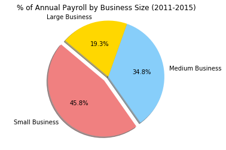


```python
biz_size = ['Small Business', 'Medium Business', 'Large Business']
pay_sums = [sb_employeesums, mb_employeesums, lb_employeesums ]
colors = ['lightcoral', 'lightskyblue', 'gold']
explode = (0.1, 0, 0)
plt.pie(pay_sums, explode=explode, labels=biz_size, colors=colors, 
       autopct = '%1.1f%%', shadow=True, startangle=140)

plt.axis('equal')
plt.title('% of Employees by Business Size (2011-2015)')

plt.show()
```


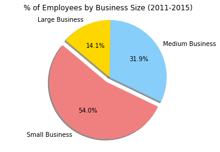


```python
biz_size = ['Small Business', 'Medium Business', 'Large Business']
pay_sums = [sb_ppp, mb_ppp, lb_ppp ]
colors = ['lightcoral', 'lightskyblue', 'gold']
explode = (0.1, 0, 0)
plt.pie(pay_sums, explode=explode, labels=biz_size, colors=colors, 
       autopct = '%1.1f%%', shadow=True, startangle=140)

plt.axis('equal')
plt.title('% of Annual Pay Per Employee by Business Size (2011-2015)')

plt.show()
```


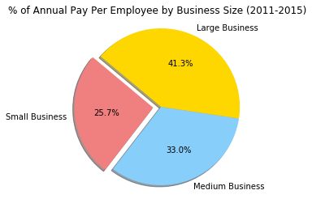


```python
# Increase of small, med, and large bussines over time compared to 
# Debt
# Per capita income
# Poverty Rate
# Unemployment


# Scatter
# Scatter states of small business from 2011-2015
# Scatter states of medium business from 2011-2015
# Scatter states of large business from 2011-2015


clean_combo_census.head()
```


<div>
<style>
    .dataframe thead tr:only-child th {
        text-align: right;
    }

    .dataframe thead th {
        text-align: left;
    }

    .dataframe tbody tr th {
        vertical-align: top;
    }
</style>
<table border="1" class="dataframe">
  <thead>
    <tr style="text-align: right;">
      <th></th>
      <th>Year</th>
      <th>Name</th>
      <th>Population</th>
      <th>Median Age</th>
      <th>Household Income</th>
      <th>Per Capita Income</th>
      <th>Poverty Count</th>
      <th>Poverty Rate</th>
      <th>Unemployment Rate</th>
      <th>Small Business Number of Establishments</th>
      <th>Small Business Employees</th>
      <th>Small Business Annual Pay</th>
      <th>Medium Business Number of Establishments</th>
      <th>Medium Business Employees</th>
      <th>Medium Business Annual Pay</th>
      <th>Large Business Number of Establishments</th>
      <th>Large Business Employees</th>
      <th>Large Business Annual Pay</th>
      <th>Minimum Wage</th>
      <th>Population Density</th>
    </tr>
  </thead>
  <tbody>
    <tr>
      <th>0</th>
      <td>2015</td>
      <td>Alaska</td>
      <td>733375</td>
      <td>33.40</td>
      <td>72515.00</td>
      <td>33413.00</td>
      <td>72957</td>
      <td>9.95</td>
      <td>4.27</td>
      <td>20510</td>
      <td>161193</td>
      <td>8583546</td>
      <td>384</td>
      <td>87605</td>
      <td>5679447</td>
      <td>13</td>
      <td>19201</td>
      <td>1380310</td>
      <td>8.75</td>
      <td>1.20</td>
    </tr>
    <tr>
      <th>1</th>
      <td>2014</td>
      <td>Alaska</td>
      <td>728300</td>
      <td>33.40</td>
      <td>71829.00</td>
      <td>33129.00</td>
      <td>71866</td>
      <td>9.87</td>
      <td>4.41</td>
      <td>20352</td>
      <td>159034</td>
      <td>8222787</td>
      <td>388</td>
      <td>90145</td>
      <td>5651558</td>
      <td>12</td>
      <td>17707</td>
      <td>1400786</td>
      <td>7.75</td>
      <td>1.20</td>
    </tr>
    <tr>
      <th>2</th>
      <td>2013</td>
      <td>Alaska</td>
      <td>720316</td>
      <td>33.60</td>
      <td>70760.00</td>
      <td>32651.00</td>
      <td>69514</td>
      <td>9.65</td>
      <td>4.57</td>
      <td>20118</td>
      <td>155418</td>
      <td>7776263</td>
      <td>387</td>
      <td>89605</td>
      <td>5362524</td>
      <td>14</td>
      <td>21604</td>
      <td>1462329</td>
      <td>7.75</td>
      <td>1.20</td>
    </tr>
    <tr>
      <th>3</th>
      <td>2012</td>
      <td>Alaska</td>
      <td>711139</td>
      <td>33.80</td>
      <td>69917.00</td>
      <td>32537.00</td>
      <td>66631</td>
      <td>9.37</td>
      <td>4.41</td>
      <td>20051</td>
      <td>153808</td>
      <td>7556795</td>
      <td>363</td>
      <td>84966</td>
      <td>5002696</td>
      <td>13</td>
      <td>19445</td>
      <td>1426912</td>
      <td>7.75</td>
      <td>1.20</td>
    </tr>
    <tr>
      <th>4</th>
      <td>2011</td>
      <td>Alaska</td>
      <td>700703</td>
      <td>33.8</td>
      <td>69014</td>
      <td>31944</td>
      <td>65111</td>
      <td>9.29</td>
      <td>4.41</td>
      <td>19746</td>
      <td>149639</td>
      <td>7252518</td>
      <td>357</td>
      <td>81009</td>
      <td>4510297</td>
      <td>16</td>
      <td>24348</td>
      <td>1631202</td>
      <td>7.75</td>
      <td>1.20</td>
    </tr>
  </tbody>
</table>
</div>


```python
# Small Business Scatter Plot Comparing Employees vs Number of Establishments Pay


#plt.scatter(clean_combo_census['Average Pay Per Employee - Small Business'],
#           clean_combo_census['Household Income'],
 #          linewidths=1, marker = 'o',
#           alpha=0.4, c='b', label='x')

#plt.scatter(clean_combo_census['Average Pay Per Employee - Medium Business'],
#           clean_combo_census['Household Income'],
#           linewidths=1, marker = 'o',
#           alpha=0.4, c='r', label='x')

#plt.scatter(clean_combo_census['Average Pay Per Employee - Large Business'],
#           clean_combo_census['Household Income'],
#           linewidths=1, marker = 'o',
#           alpha=0.4, c='y', label='x')


# Other graph properties

#plt.title('Employees vs Number of Establishments')
#plt.xlabel('Employees')
#plt.ylabel('Number of Establishments')
#plt.grid(True)
#plt.xlim([-10, 80])
#plt.ylim([-20, 120])

# Save figure
#plt.savefig('Temperature_vs_Latitude.png')

# Plot
#plt.show()

```


```python
# Bar Graph - Average US Household Income vs income Small, Med, Large Income per employee

employment_census_2011['Per Capita Income'] = employment_census_2011['Per Capita Income'].astype(int)
employment_census_2012['Per Capita Income'] = employment_census_2012['Per Capita Income'].astype(int)
employment_census_2013['Per Capita Income'] = employment_census_2013['Per Capita Income'].astype(int)
employment_census_2014['Per Capita Income'] = employment_census_2014['Per Capita Income'].astype(int)
employment_census_2015['Per Capita Income'] = employment_census_2015['Per Capita Income'].astype(int)


pc_2011 = employment_census_2011['Per Capita Income'].mean()
pc_2012 = employment_census_2012['Per Capita Income'].mean()
pc_2013 = employment_census_2013['Per Capita Income'].mean()
pc_2014 = employment_census_2014['Per Capita Income'].mean()
pc_2015 = employment_census_2015['Per Capita Income'].mean()


sb2011_ppp = (sb2011_sums['Small Business Annual Pay'] / sb2011_sums['Small Business Employees'])*1000
sb2011_ppp_mean = sb2011_ppp.mean()

sb2012_ppp = (sb2012_sums['Small Business Annual Pay'] / sb2012_sums['Small Business Employees'])*1000
sb2012_ppp_mean = sb2012_ppp.mean()

sb2013_ppp = (sb2013_sums['Small Business Annual Pay'] / sb2013_sums['Small Business Employees'])*1000
sb2013_ppp_mean = sb2013_ppp.mean()

sb2014_ppp = (sb2014_sums['Small Business Annual Pay'] / sb2014_sums['Small Business Employees'])*1000
sb2014_ppp_mean = sb2014_ppp.mean()

sb2015_ppp = (sb2015_sums['Small Business Annual Pay'] / sb2015_sums['Small Business Employees'])*1000
sb2015_ppp_mean = sb2015_ppp.mean()

mb2011_ppp = (mb2011_sums['Medium Business Annual Pay'] / mb2011_sums['Medium Business Employees'])*1000
mb2011_ppp_mean = mb2011_ppp.mean()

mb2012_ppp = (mb2012_sums['Medium Business Annual Pay'] / mb2012_sums['Medium Business Employees'])*1000
mb2012_ppp_mean = mb2012_ppp.mean()

mb2013_ppp = (mb2013_sums['Medium Business Annual Pay'] / mb2013_sums['Medium Business Employees'])*1000
mb2013_ppp_mean = mb2012_ppp.mean()

mb2014_ppp = (mb2014_sums['Medium Business Annual Pay'] / mb2014_sums['Medium Business Employees'])*1000
mb2014_ppp_mean = mb2014_ppp.mean()

mb2015_ppp = (mb2015_sums['Medium Business Annual Pay'] / mb2015_sums['Medium Business Employees'])*1000
mb2015_ppp_mean = mb2015_ppp.mean()


lb2011_ppp = (lb2011_sums['Large Business Annual Pay'] / lb2011_sums['Large Business Employees'])*1000
lb2011_ppp_mean = lb2011_ppp.mean()

lb2012_ppp = (lb2012_sums['Large Business Annual Pay'] / lb2012_sums['Large Business Employees'])*1000
lb2012_ppp_mean = lb2012_ppp.mean()

lb2013_ppp = (lb2013_sums['Large Business Annual Pay'] / lb2013_sums['Large Business Employees'])*1000
lb2013_ppp_mean = lb2013_ppp.mean()

lb2014_ppp = (lb2014_sums['Large Business Annual Pay'] / lb2014_sums['Large Business Employees'])*1000
lb2014_ppp_mean = lb2014_ppp.mean()

lb2015_ppp = (lb2015_sums['Large Business Annual Pay'] / lb2015_sums['Large Business Employees'])*1000
lb2015_ppp_mean = lb2015_ppp.mean()


#avg.round(2)  
#sb2011_sums = small_biz_2011.groupby('State').sum(numeric_only=True)

#avgs_2011_df = pd.pivot(index=None, columns='Name', values='Values')

#lb2015_sums = lb2015_sums.reset_index(drop=False)

```


```python
percap_income = [pc_2011, pc_2012, pc_2013, pc_2014, pc_2015]
small_biz_ppp = [sb2011_ppp_mean, sb2012_ppp_mean, sb2013_ppp_mean, sb2014_ppp_mean, sb2015_ppp_mean]
med_biz_ppp = [mb2011_ppp_mean, mb2012_ppp_mean, mb2013_ppp_mean, mb2014_ppp_mean, mb2015_ppp_mean]
large_biz_ppp = [lb2011_ppp_mean, lb2012_ppp_mean, lb2013_ppp_mean, lb2014_ppp_mean, lb2015_ppp_mean]


years = np.arange(2011, 2016, 1)

```


```python
percap_handle, = plt.plot(years, percap_income, color='red', label='Per Capita Income')
small_biz_handle, = plt.plot(years, small_biz_ppp, color='b', label='Small Business Pay Per Person')
med_biz_handle, = plt.plot(years, med_biz_ppp, color='y', label='Medium Business Pay Per Person')
large_biz_handle, = plt.plot(years, large_biz_ppp, color='g', label='Large Business Pay Per Person')

plt.grid()

plt.xlim(2011,2015)
plt.ylim(25000, 65000)
#
# Adjust ticks
plt.xticks(np.arange(2011, 2016, 1), size=10)

plt.title('Average US Per Capita Income vs Average US Business Annual Pay Per Employee')
plt.xlabel('Year')
plt.ylabel('US Dollars Annual')

plt.legend(handles=[percap_handle, small_biz_handle, med_biz_handle, large_biz_handle], bbox_to_anchor = (1.05, 1), loc=2)

plt.savefig('Pay Capita Income vs Pay Per Employee')

plt.show()
```


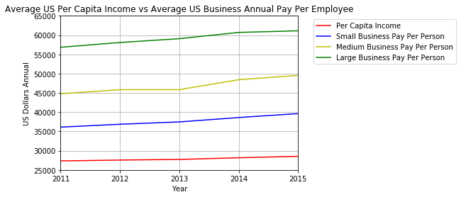


```python
#graph minimum wage vs Establishments 
#Set figure size
fig = plt.figure(figsize=(8,12))

small_min_wage_plot_2015 = clean_combo_census.loc[clean_combo_census["Year"] == "2015"]
small_min_wage_plot_2014 = clean_combo_census.loc[clean_combo_census["Year"] == "2014"]
small_min_wage_plot_2013 = clean_combo_census.loc[clean_combo_census["Year"] == "2013"]
small_min_wage_plot_2012 = clean_combo_census.loc[clean_combo_census["Year"] == "2012"]
small_min_wage_plot_2011 = clean_combo_census.loc[clean_combo_census["Year"] == "2011"]

pop_count_2015 =small_min_wage_plot_2015["Population"]/10000
pop_count_2014 =small_min_wage_plot_2014["Population"]/10000
pop_count_2013 =small_min_wage_plot_2013["Population"]/10000
pop_count_2012 =small_min_wage_plot_2012["Population"]/10000
pop_count_2011 =small_min_wage_plot_2011["Population"]/10000

#plot with the colors
colors = ['b', 'c', 'y', 'm', 'r']
small_min_wage_plot_2015 = plt.scatter(small_min_wage_plot_2015["Minimum Wage"],small_min_wage_plot_2015["Small Business Number of Establishments"],
                                       c=colors[0],s=pop_count_2015, edgecolors='black',alpha=0.4)
small_min_wage_plot_2014 = plt.scatter(small_min_wage_plot_2014["Minimum Wage"],small_min_wage_plot_2014["Small Business Number of Establishments"],
                                       c=colors[1],s=pop_count_2014,edgecolors='black',alpha=0.4)
small_min_wage_plot_2013 = plt.scatter(small_min_wage_plot_2013["Minimum Wage"],small_min_wage_plot_2013["Small Business Number of Establishments"],
                                       c=colors[2],s=pop_count_2013,edgecolors='black',alpha=0.4)
small_min_wage_plot_2012 = plt.scatter(small_min_wage_plot_2012["Minimum Wage"],small_min_wage_plot_2012["Small Business Number of Establishments"],
                                       c=colors[3],s=pop_count_2012,edgecolors='black',alpha=0.4)
small_min_wage_plot_2011 = plt.scatter(small_min_wage_plot_2011["Minimum Wage"],small_min_wage_plot_2011["Small Business Number of Establishments"],
                                       c=colors[4],s=pop_count_2011,edgecolors='black',alpha=0.4)

#Add labels to the x and y axes
plt.title("Minimum Wage VS.Number of Small Businesses per State for 5 years")
plt.xlabel("Minimum Wage")
plt.ylabel("Establishments")
plt.legend((small_min_wage_plot_2015,small_min_wage_plot_2014, small_min_wage_plot_2013, small_min_wage_plot_2012,small_min_wage_plot_2011)
           ,("2015", "2014", "2013","2012","2011"),markerscale=.1)

plt.xticks(np.arange(7.25,10.75,.25), size = 10)
plt.text(11, 0,'Note: \n Circle size correlates with population size of the State.',
     horizontalalignment='left',
     verticalalignment='center')
# Save Figure
plt.savefig("Min_wage vs. Small Est.png")

plt.show()
```


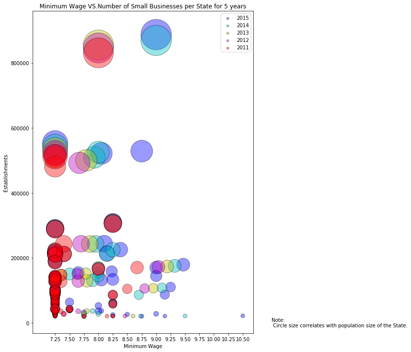


```python
#graph minimum wage vs Establishments 
#Set figure size
fig = plt.figure(figsize=(8,12))

med_min_wage_plot_2015 = clean_combo_census.loc[clean_combo_census["Year"] == "2015"]
med_min_wage_plot_2014 = clean_combo_census.loc[clean_combo_census["Year"] == "2014"]
med_min_wage_plot_2013 = clean_combo_census.loc[clean_combo_census["Year"] == "2013"]
med_min_wage_plot_2012 = clean_combo_census.loc[clean_combo_census["Year"] == "2012"]
med_min_wage_plot_2011 = clean_combo_census.loc[clean_combo_census["Year"] == "2011"]

pop_count_2015 =med_min_wage_plot_2015["Population"]/10000
pop_count_2014 =med_min_wage_plot_2014["Population"]/10000
pop_count_2013 =med_min_wage_plot_2013["Population"]/10000
pop_count_2012 =med_min_wage_plot_2012["Population"]/10000
pop_count_2011 =med_min_wage_plot_2011["Population"]/10000

#plot with the colors
colors = ['b', 'c', 'y', 'm', 'r']
med_min_wage_plot_2015 = plt.scatter(med_min_wage_plot_2015["Minimum Wage"],med_min_wage_plot_2015["Medium Business Number of Establishments"],
                                       c=colors[0],s=pop_count_2015, edgecolors='black',alpha=0.4)
med_min_wage_plot_2014 = plt.scatter(med_min_wage_plot_2014["Minimum Wage"],med_min_wage_plot_2014["Medium Business Number of Establishments"],
                                       c=colors[1],s=pop_count_2014,edgecolors='black',alpha=0.4)
med_min_wage_plot_2013 = plt.scatter(med_min_wage_plot_2013["Minimum Wage"],med_min_wage_plot_2013["Medium Business Number of Establishments"],
                                       c=colors[2],s=pop_count_2013,edgecolors='black',alpha=0.4)
med_min_wage_plot_2012 = plt.scatter(med_min_wage_plot_2012["Minimum Wage"],med_min_wage_plot_2012["Medium Business Number of Establishments"],
                                       c=colors[3],s=pop_count_2012,edgecolors='black',alpha=0.4)
med_min_wage_plot_2011 = plt.scatter(med_min_wage_plot_2011["Minimum Wage"],med_min_wage_plot_2011["Medium Business Number of Establishments"],
                                       c=colors[4],s=pop_count_2011,edgecolors='black',alpha=0.4)

#Add labels to the x and y axes
plt.title("Minimum Wage VS.Number of Medium Businesses per State for 5 years")
plt.xlabel("Minimum Wage")
plt.ylabel("Establishments")
plt.legend((med_min_wage_plot_2015,med_min_wage_plot_2014, med_min_wage_plot_2013, med_min_wage_plot_2012,med_min_wage_plot_2011)
           ,("2015", "2014", "2013","2012","2011"),markerscale=.1)

plt.xticks(np.arange(7.25,10.75,.25), size = 10)
plt.text(11, 0,'Note: \n Circle size correlates with population size of the State.',
     horizontalalignment='left',
     verticalalignment='center')
# Save Figure
plt.savefig("Min_wage vs. Med Est.png")

plt.show()
```


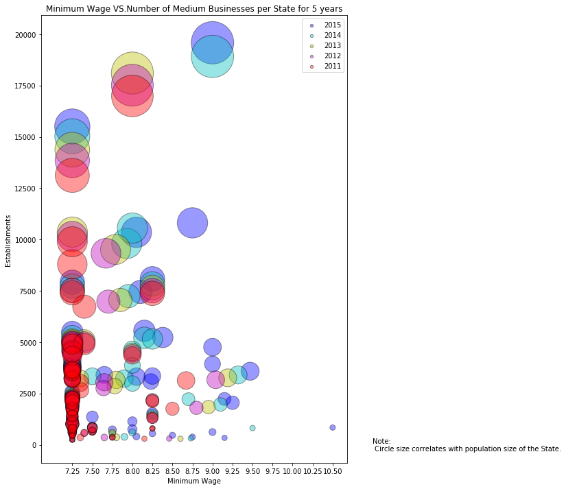


```python
#graph minimum wage vs Establishments 
#Set figure size
fig = plt.figure(figsize=(8,12))

lar_min_wage_plot_2015 = clean_combo_census.loc[clean_combo_census["Year"] == "2015"]
lar_min_wage_plot_2014 = clean_combo_census.loc[clean_combo_census["Year"] == "2014"]
lar_min_wage_plot_2013 = clean_combo_census.loc[clean_combo_census["Year"] == "2013"]
lar_min_wage_plot_2012 = clean_combo_census.loc[clean_combo_census["Year"] == "2012"]
lar_min_wage_plot_2011 = clean_combo_census.loc[clean_combo_census["Year"] == "2011"]

pop_count_2015 =lar_min_wage_plot_2015["Population"]/10000
pop_count_2014 =lar_min_wage_plot_2014["Population"]/10000
pop_count_2013 =lar_min_wage_plot_2013["Population"]/10000
pop_count_2012 =lar_min_wage_plot_2012["Population"]/10000
pop_count_2011 =lar_min_wage_plot_2011["Population"]/10000

#plot with the colors
colors = ['b', 'c', 'y', 'm', 'r']
lar_min_wage_plot_2015 = plt.scatter(lar_min_wage_plot_2015["Minimum Wage"],lar_min_wage_plot_2015["Large Business Number of Establishments"],
                                       c=colors[0],s=pop_count_2015, edgecolors='black',alpha=0.4)
lar_min_wage_plot_2014 = plt.scatter(lar_min_wage_plot_2014["Minimum Wage"],lar_min_wage_plot_2014["Large Business Number of Establishments"],
                                       c=colors[1],s=pop_count_2014,edgecolors='black',alpha=0.4)
lar_min_wage_plot_2013 = plt.scatter(lar_min_wage_plot_2013["Minimum Wage"],lar_min_wage_plot_2013["Large Business Number of Establishments"],
                                       c=colors[2],s=pop_count_2013,edgecolors='black',alpha=0.4)
lar_min_wage_plot_2012 = plt.scatter(lar_min_wage_plot_2012["Minimum Wage"],lar_min_wage_plot_2012["Large Business Number of Establishments"],
                                       c=colors[3],s=pop_count_2012,edgecolors='black',alpha=0.4)
lar_min_wage_plot_2011 = plt.scatter(lar_min_wage_plot_2011["Minimum Wage"],lar_min_wage_plot_2011["Large Business Number of Establishments"],
                                       c=colors[4],s=pop_count_2011,edgecolors='black',alpha=0.4)

#Add labels to the x and y axes
plt.title("Minimum Wage VS.Number of Large Businesses per State for 5 years")
plt.xlabel("Minimum Wage")
plt.ylabel("Establishments")
plt.legend((lar_min_wage_plot_2015,lar_min_wage_plot_2014, lar_min_wage_plot_2013, lar_min_wage_plot_2012,lar_min_wage_plot_2011)
           ,("2015", "2014", "2013","2012","2011"),markerscale=.1)

plt.xticks(np.arange(7.25,10.75,.25), size = 10)
plt.text(11, 0,'Note: \n Circle size correlates with Population Size of State.',
     horizontalalignment='left',
     verticalalignment='center')
# Save Figure
plt.savefig("Min_wage vs. lar Est.png")

plt.show()

```


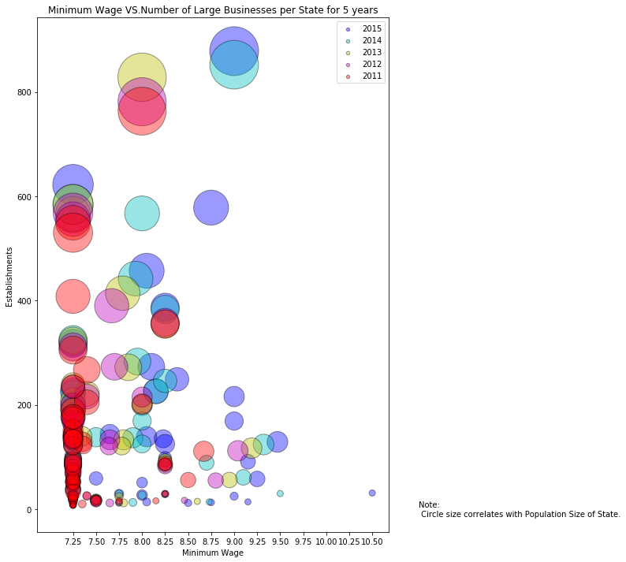


```python
#graph minimum wage vs Establishments 
#Set figure size
fig = plt.figure(figsize=(8,12))

small_min_wage_plot_2015 = clean_combo_census.loc[clean_combo_census["Year"] == "2015"]
small_min_wage_plot_2014 = clean_combo_census.loc[clean_combo_census["Year"] == "2014"]
small_min_wage_plot_2013 = clean_combo_census.loc[clean_combo_census["Year"] == "2013"]
small_min_wage_plot_2012 = clean_combo_census.loc[clean_combo_census["Year"] == "2012"]
small_min_wage_plot_2011 = clean_combo_census.loc[clean_combo_census["Year"] == "2011"]

pop_count_2015 =small_min_wage_plot_2015["Population Density"]
pop_count_2014 =small_min_wage_plot_2014["Population Density"]
pop_count_2013 =small_min_wage_plot_2013["Population Density"]
pop_count_2012 =small_min_wage_plot_2012["Population Density"]
pop_count_2011 =small_min_wage_plot_2011["Population Density"]

#plot with the colors
colors = ['b', 'c', 'y', 'm', 'r']
small_min_wage_plot_2015 = plt.scatter(small_min_wage_plot_2015["Minimum Wage"],small_min_wage_plot_2015["Small Business Number of Establishments"],
                                       c=colors[0],s=pop_count_2015, edgecolors='black',alpha=0.4)
small_min_wage_plot_2014 = plt.scatter(small_min_wage_plot_2014["Minimum Wage"],small_min_wage_plot_2014["Small Business Number of Establishments"],
                                       c=colors[1],s=pop_count_2014,edgecolors='black',alpha=0.4)
small_min_wage_plot_2013 = plt.scatter(small_min_wage_plot_2013["Minimum Wage"],small_min_wage_plot_2013["Small Business Number of Establishments"],
                                       c=colors[2],s=pop_count_2013,edgecolors='black',alpha=0.4)
small_min_wage_plot_2012 = plt.scatter(small_min_wage_plot_2012["Minimum Wage"],small_min_wage_plot_2012["Small Business Number of Establishments"],
                                       c=colors[3],s=pop_count_2012,edgecolors='black',alpha=0.4)
small_min_wage_plot_2011 = plt.scatter(small_min_wage_plot_2011["Minimum Wage"],small_min_wage_plot_2011["Small Business Number of Establishments"],
                                       c=colors[4],s=pop_count_2011,edgecolors='black',alpha=0.4)

#Add labels to the x and y axes
plt.title("Minimum Wage VS.Number of Small Businesses per State for 5 years")
plt.xlabel("Minimum Wage")
plt.ylabel("Establishments")
plt.legend((small_min_wage_plot_2015,small_min_wage_plot_2014, small_min_wage_plot_2013, small_min_wage_plot_2012,small_min_wage_plot_2011)
           ,("2015", "2014", "2013","2012","2011"),markerscale=.1)

plt.xticks(np.arange(7.25,10.75,.25), size = 10)
plt.text(11, 0,'Note: \n Circle size correlates with population density of each State.',
     horizontalalignment='left',
     verticalalignment='center')
# Save Figure
plt.savefig("Min_wage vs. Small Est Pop Dense.png")

plt.show()
```


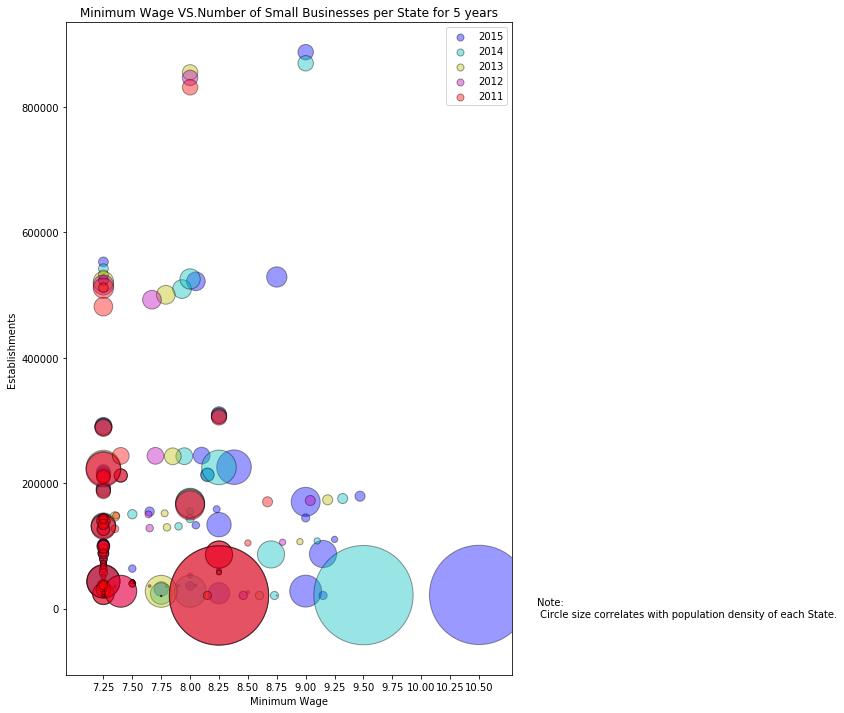


```python
#graph minimum wage vs Establishments 
#Set figure size
fig = plt.figure(figsize=(8,12))

med_min_wage_plot_2015 = clean_combo_census.loc[clean_combo_census["Year"] == "2015"]
med_min_wage_plot_2014 = clean_combo_census.loc[clean_combo_census["Year"] == "2014"]
med_min_wage_plot_2013 = clean_combo_census.loc[clean_combo_census["Year"] == "2013"]
med_min_wage_plot_2012 = clean_combo_census.loc[clean_combo_census["Year"] == "2012"]
med_min_wage_plot_2011 = clean_combo_census.loc[clean_combo_census["Year"] == "2011"]

pop_count_2015 =med_min_wage_plot_2015["Population Density"]
pop_count_2014 =med_min_wage_plot_2014["Population Density"]
pop_count_2013 =med_min_wage_plot_2013["Population Density"]
pop_count_2012 =med_min_wage_plot_2012["Population Density"]
pop_count_2011 =med_min_wage_plot_2011["Population Density"]

#plot with the colors
colors = ['b', 'c', 'y', 'm', 'r']
med_min_wage_plot_2015 = plt.scatter(med_min_wage_plot_2015["Minimum Wage"],med_min_wage_plot_2015["Medium Business Number of Establishments"],
                                       c=colors[0],s=pop_count_2015, edgecolors='black',alpha=0.4)
med_min_wage_plot_2014 = plt.scatter(med_min_wage_plot_2014["Minimum Wage"],med_min_wage_plot_2014["Medium Business Number of Establishments"],
                                       c=colors[1],s=pop_count_2014,edgecolors='black',alpha=0.4)
med_min_wage_plot_2013 = plt.scatter(med_min_wage_plot_2013["Minimum Wage"],med_min_wage_plot_2013["Medium Business Number of Establishments"],
                                       c=colors[2],s=pop_count_2013,edgecolors='black',alpha=0.4)
med_min_wage_plot_2012 = plt.scatter(med_min_wage_plot_2012["Minimum Wage"],med_min_wage_plot_2012["Medium Business Number of Establishments"],
                                       c=colors[3],s=pop_count_2012,edgecolors='black',alpha=0.4)
med_min_wage_plot_2011 = plt.scatter(med_min_wage_plot_2011["Minimum Wage"],med_min_wage_plot_2011["Medium Business Number of Establishments"],
                                       c=colors[4],s=pop_count_2011,edgecolors='black',alpha=0.4)

#Add labels to the x and y axes
plt.title("Minimum Wage VS.Number of Medium Businesses per State for 5 years")
plt.xlabel("Minimum Wage")
plt.ylabel("Establishments")
plt.legend((med_min_wage_plot_2015,med_min_wage_plot_2014, med_min_wage_plot_2013, med_min_wage_plot_2012,med_min_wage_plot_2011)
           ,("2015", "2014", "2013","2012","2011"),markerscale=.1)

plt.xticks(np.arange(7.25,10.75,.25), size = 10)
plt.text(11, 0,'Note: \n Circle size correlates with population density of each State.',
     horizontalalignment='left',
     verticalalignment='center')
# Save Figure
plt.savefig("Min_wage vs. Med Est pop dens.png")

plt.show()
```


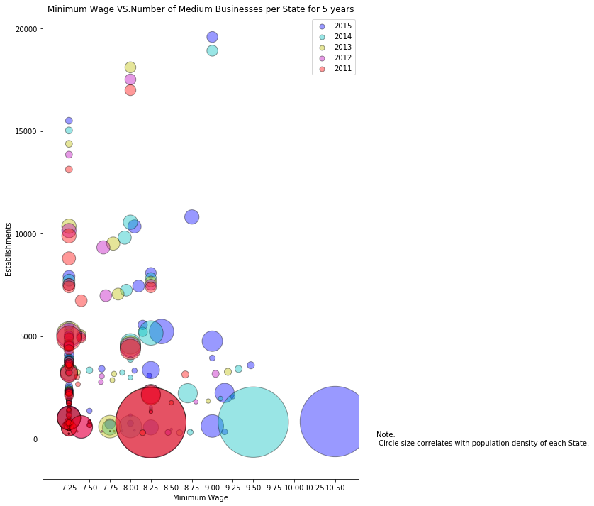


```python
#graph minimum wage vs Establishments 
#Set figure size
fig = plt.figure(figsize=(8,12))

lar_min_wage_plot_2015 = clean_combo_census.loc[clean_combo_census["Year"] == "2015"]
lar_min_wage_plot_2014 = clean_combo_census.loc[clean_combo_census["Year"] == "2014"]
lar_min_wage_plot_2013 = clean_combo_census.loc[clean_combo_census["Year"] == "2013"]
lar_min_wage_plot_2012 = clean_combo_census.loc[clean_combo_census["Year"] == "2012"]
lar_min_wage_plot_2011 = clean_combo_census.loc[clean_combo_census["Year"] == "2011"]

pop_count_2015 =lar_min_wage_plot_2015["Population Density"]
pop_count_2014 =lar_min_wage_plot_2014["Population Density"]
pop_count_2013 =lar_min_wage_plot_2013["Population Density"]
pop_count_2012 =lar_min_wage_plot_2012["Population Density"]
pop_count_2011 =lar_min_wage_plot_2011["Population Density"]

#plot with the colors
colors = ['b', 'c', 'y', 'm', 'r']
lar_min_wage_plot_2015 = plt.scatter(lar_min_wage_plot_2015["Minimum Wage"],lar_min_wage_plot_2015["Large Business Number of Establishments"],
                                       c=colors[0],s=pop_count_2015, edgecolors='black',alpha=0.4)
lar_min_wage_plot_2014 = plt.scatter(lar_min_wage_plot_2014["Minimum Wage"],lar_min_wage_plot_2014["Large Business Number of Establishments"],
                                       c=colors[1],s=pop_count_2014,edgecolors='black',alpha=0.4)
lar_min_wage_plot_2013 = plt.scatter(lar_min_wage_plot_2013["Minimum Wage"],lar_min_wage_plot_2013["Large Business Number of Establishments"],
                                       c=colors[2],s=pop_count_2013,edgecolors='black',alpha=0.4)
lar_min_wage_plot_2012 = plt.scatter(lar_min_wage_plot_2012["Minimum Wage"],lar_min_wage_plot_2012["Large Business Number of Establishments"],
                                       c=colors[3],s=pop_count_2012,edgecolors='black',alpha=0.4)
lar_min_wage_plot_2011 = plt.scatter(lar_min_wage_plot_2011["Minimum Wage"],lar_min_wage_plot_2011["Large Business Number of Establishments"],
                                       c=colors[4],s=pop_count_2011,edgecolors='black',alpha=0.4)

#Add labels to the x and y axes
plt.title("Minimum Wage VS.Number of Large Businesses per State for 5 years")
plt.xlabel("Minimum Wage")
plt.ylabel("Establishments")
plt.legend((lar_min_wage_plot_2015,lar_min_wage_plot_2014, lar_min_wage_plot_2013, lar_min_wage_plot_2012,lar_min_wage_plot_2011)
           ,("2015", "2014", "2013","2012","2011"),markerscale=.1)

plt.xticks(np.arange(7.25,10.75,.25), size = 10)
plt.text(11, 0,'Note: \n Circle size correlates with population density of each State.',
     horizontalalignment='left',
     verticalalignment='center')
# Save Figure
plt.savefig("Min_wage vs. Large Est Pop Dense.png")

plt.show()

```


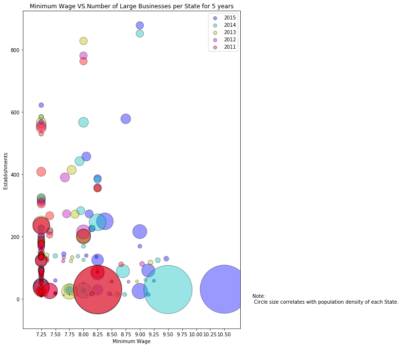


```python
#Plot Small Business Establishments V.S Household Income
plt.scatter(employment_census_2015['Small Business Number of Establishments'], 
            employment_census_2015['Household Income'], marker="o", c ="red", edgecolors="black",
            label='2015',
             alpha=0.6)

plt.scatter(employment_census_2014['Small Business Number of Establishments'], 
            employment_census_2014['Household Income'], marker="o", c ="blue", edgecolors="black",
            label='2014',
             alpha=0.6)
plt.scatter(employment_census_2013['Small Business Number of Establishments'], 
            employment_census_2013['Household Income'], marker="o", c ="green", edgecolors="black",
            label='2013',
            alpha=0.6)

plt.title("# of Small Business Establishments V.S. Household Income")
plt.xlabel("Total Number of Establisments")
plt.ylabel("Household Income")
plt.grid()
plt.xlim(0, 600000)
plt.ylim(35000, 80000)
# Now add the legend with some customizations.
legend = plt.legend(loc='best', shadow=True)
plt.savefig("Small Business Estab V.S. Household Income.png")

plt.show()
```


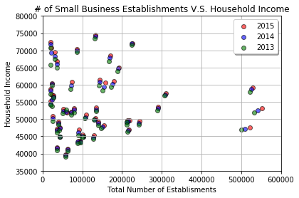


```python
#Plot Medium Business Establishments V.S. Household Income
plt.scatter(employment_census_2015['Medium Business Number of Establishments'], 
            employment_census_2015['Household Income'], marker="o", c ="red", edgecolors="black",
            label='2015',
             alpha=0.6)
plt.scatter(employment_census_2014['Medium Business Number of Establishments'], 
            employment_census_2014['Household Income'], marker="o", c ="blue", edgecolors="black",
            label='2014',
             alpha=0.6)
plt.scatter(employment_census_2013['Medium Business Number of Establishments'], 
            employment_census_2013['Household Income'], marker="o", c ="green", edgecolors="black",
            label='2013',
             alpha=0.6)

plt.title("# of Medium Business Establishments V.S. Household Income")
plt.xlabel("Total Number of Establisments")
plt.ylabel("Household Income")
plt.grid()
plt.xlim(0, 12500)
plt.ylim(35000, 80000)
legend = plt.legend(loc='best', shadow=True)
plt.savefig("Med Business Estab V.S. Household Income.png")

plt.show()
```


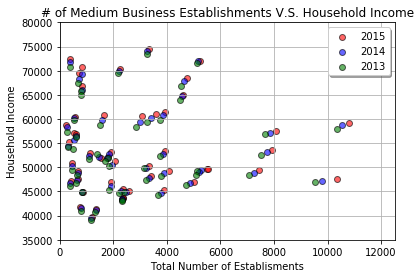


```python
#Plot Large Business Establishments V.S. Household Income

plt.scatter(employment_census_2015['Large Business Number of Establishments'], 
            employment_census_2015['Household Income'], marker="o", c ="red", edgecolors="black",
            label='2015',
             alpha=0.6)
plt.scatter(employment_census_2014['Large Business Number of Establishments'], 
            employment_census_2014['Household Income'], marker="o", c ="blue", edgecolors="black",
            label='2014',
             alpha=0.6)
plt.scatter(employment_census_2013['Large Business Number of Establishments'], 
            employment_census_2013['Household Income'], marker="o", c ="green", edgecolors="black",
            label='2013',
             alpha=0.6)

plt.title("# of Large Business Establishments V.S. Household Income")
plt.xlabel("Total Number of Establisments")
plt.ylabel("Household Income")
plt.xlim(0, 650)
plt.ylim(35000, 77000)
plt.grid()
legend = plt.legend(loc='best', shadow=True)
plt.savefig("Large Business Estab V.S. Household Income.png")

plt.show()
```


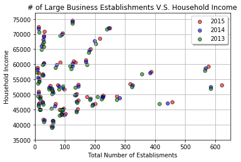


```python
#Get percent changes of household income
household_2015= census_pd_2015['Household Income'].sum()

census_pd_2011['Household Income'] = census_pd_2011['Household Income'].astype(int)
household_2011 = census_pd_2011['Household Income'].sum()
household_change = ((household_2015-household_2011)/(household_2011))*100
household_change

#Get Percent Change of Small Business Estab
employment_census_2015['Small Business Number of Establishments'] = employment_census_2015['Small Business Number of Establishments'].astype(int)
employment_census_2011['Small Business Number of Establishments'] = employment_census_2011['Small Business Number of Establishments'].astype(int)

small_estab_2015 = employment_census_2015['Small Business Number of Establishments'].sum()
small_estab_2011 = employment_census_2011['Small Business Number of Establishments'].sum()
small_estab_change = ((small_estab_2015-small_estab_2011)/(small_estab_2011))*100
small_estab_change

#Get Percent Change of Medium Business Estab
employment_census_2015['Medium Business Number of Establishments'] = employment_census_2015['Medium Business Number of Establishments'].astype(int)
employment_census_2011['Medium Business Number of Establishments'] = employment_census_2011['Medium Business Number of Establishments'].astype(int)

med_estab_2015 = employment_census_2015['Medium Business Number of Establishments'].sum()
med_estab_2011 = employment_census_2011['Medium Business Number of Establishments'].sum()
med_estab_change = ((med_estab_2015-med_estab_2011)/(med_estab_2011))*100
med_estab_change

#Get Percent Change of Large Business Estab
employment_census_2015['Large Business Number of Establishments'] = employment_census_2015['Large Business Number of Establishments'].astype(int)
employment_census_2011['Large Business Number of Establishments'] = employment_census_2011['Large Business Number of Establishments'].astype(int)

large_estab_2015 = employment_census_2015['Large Business Number of Establishments'].sum()
large_estab_2011 = employment_census_2011['Large Business Number of Establishments'].sum()
large_estab_change = ((large_estab_2015-large_estab_2011)/(large_estab_2011))*100
large_estab_change
```


    10.487661574618096


```python
compound_change =[small_estab_change, med_estab_change, large_estab_change, household_change]
colors=['green','blue','red','gold']
x_axis = np.arange(len(compound_change))
plt.bar(x_axis, compound_change, color=colors, alpha=0.5, align="edge", width= 1.0)
tick_locations = [value+0.5 for value in x_axis]
plt.xticks(tick_locations, ["Small Businesses", "Medium Businesses","Large Businesses","Household Income"],rotation=45)
plt.grid()
plt.title("Percent Change from 2011 - 2015")
plt.ylabel("Percent Change")
plt.savefig("% Change 2011-2015 Bar.png")
plt.show()
```


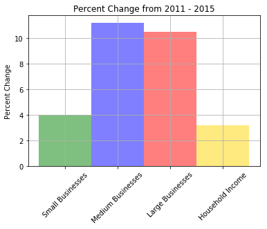


```python

```
